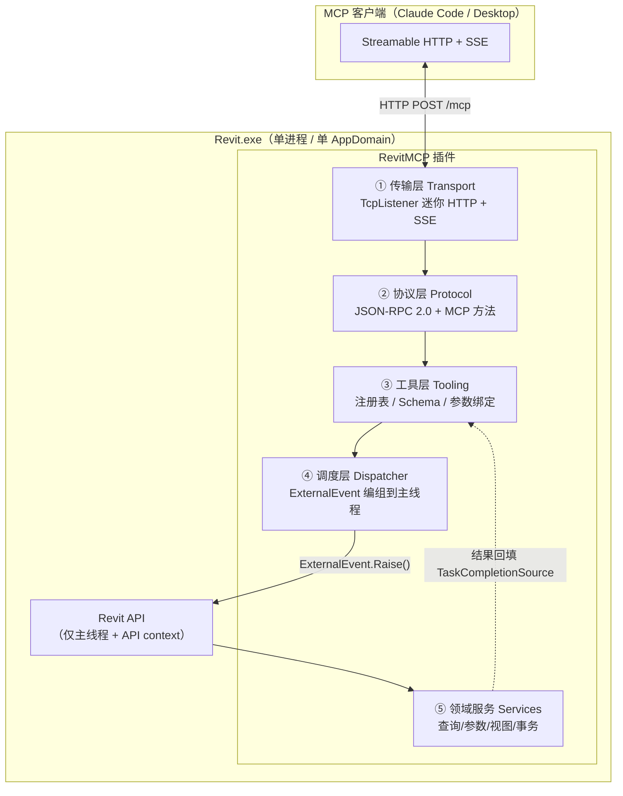

# RevitMCP 架构设计方案

> 目标形态：**纯 C# 单进程**——MCP Server 直接跑在 Revit 进程内，由插件托管。
> 目标平台：**Revit 2019 – 2024**（2019/2020 为 .NET Framework 4.7，2021+ 为 4.8）。
> 状态：M0 骨架已落地。下文标注 **[M0 已修订]** 的条目是实现阶段推翻的原始设计，以修订后内容为准。

---

## 0. 目标与非目标

### 目标
- 让 Claude Code / Claude Desktop 等 MCP 客户端能直接读写**当前打开的 Revit 文档**。
- 提供一套**可扩展的工具（Tool）开发框架**：新增一个工具 = 写一个类 + 一个 DTO，不碰传输层和协议层。
- 正确处理 Revit 的 **API 上下文与线程约束**，不出现"跨线程调用 API"崩溃。
- 写操作可撤销、可审计、默认关闭。

### 非目标（本期不做）
- 不做无界面/批处理模式（Revit 需要已启动并打开文档）。
- 不做 Revit Server / BIM360 协同层的封装。
- 不做远程访问（只监听 `127.0.0.1`）。
- ~~不做多版本同源产出~~ **[M0 已修订]** 最低版本定为 2019 后，2019–2024 六个版本的多版本矩阵
  已在 M0 建成（一套源码 + 按配置切换 TFM / API 包 / 编译符号，见 §9）。
  这类能力后补的代价远高于一开始就做。

---

## 1. 总体架构



**线程边界只有一条，且只在 ④**：①②③ 全部跑在后台线程池，⑤ 只在 Revit 主线程执行。这条边界是整个框架的核心，见 §5。

### 分层职责

| 层 | 程序集 | 目标框架 | 是否依赖 Revit API |
|---|---|---|---|
| ① 传输 | `RevitMCP.Transport` | netstandard2.0 | ✗ |
| ② 协议 | `RevitMCP.Protocol` | netstandard2.0 | ✗ |
| ③ 工具框架 | `RevitMCP.Tooling` | netstandard2.0 | ✗ |
| ④⑤ 宿主+工具实现 | `RevitMCP.Addin` | net48 | ✓ |

**刻意把 ①②③ 做成不依赖 Revit 的程序集**，目的是这三层能脱离 Revit 跑普通单元测试（见 §11）。只有 `RevitMCP.Addin` 需要 Revit 才能测。

---

## 2. 关键约束 → 设计决策

这一节是全文的推导依据，后面所有选择都能回溯到这里。

| # | 约束（Revit / MCP 的硬事实） | 推导出的决策 |
|---|---|---|
| C1 | Revit API 只能在**主线程**、且处于 **API context** 时调用 | 引入 `RevitDispatcher`（`IExternalEventHandler`），所有 API 调用编组过去（§5） |
| C2 | Revit 把所有插件加载进**同一个 AppDomain**，且**不应用插件自己的绑定重定向**（生效的是 `Revit.exe.config`） | 协议层尽量零第三方依赖；依赖必须 ILRepack 内联化（§4） |
| C3 | Revit 是用户手动启动的 GUI 进程，MCP 客户端**无法把它当 stdio 子进程拉起** | 传输必须是 **HTTP**（Streamable HTTP），不能用 stdio（§3） |
| C4 | `System.Net.HttpListener` 在非管理员下常因 URL ACL 报 `Access is denied` | 自己用 `TcpListener` 写迷你 HTTP/1.1 服务（§3） |
| C5 | 事务中的警告会弹**模态对话框**，把整个 Revit 和服务一起卡死 | 强制 `IFailuresPreprocessor` + `DialogBoxShowing` 拦截（§7） |
| C6 | 有模态对话框打开时，`ExternalEvent` 不会被执行 | 每次调用必须有超时，并返回明确的 `REVIT_BUSY`（§5） |
| C7 | 本地 HTTP MCP 服务面临 DNS rebinding 攻击（MCP 规范明确要求校验 `Origin`） | 强制 `Origin` 白名单 + Bearer Token + 仅绑 `127.0.0.1`（§8） |
| C8 | Revit 2024 起 `ElementId` 变为 64 位（`.Value`），`IntegerValue` 弃用 | 全局走 `ElementIdCompat` shim，ID 在协议上一律用字符串（§9） |

---

## 3. ① 传输层设计

### 为什么不是 stdio
MCP 最常见的是 stdio，但 stdio 要求客户端**自己 spawn 服务进程**。Revit 是用户双击启动的重型 GUI 应用，不可能由 Claude 拉起。因此只能反过来：Revit 常驻，客户端连过来 → **Streamable HTTP**。

客户端接入方式：
```bash
claude mcp add --transport http revit http://127.0.0.1:7801/mcp --header "Authorization: Bearer <token>"
```

### 为什么不用 HttpListener
`HttpListener` 需要 URL 预留（`netsh http add urlacl`），否则非管理员启动 Revit 时大概率抛 `HttpListenerException(5)`。要求用户以管理员跑 Revit 或手动 netsh，是不可接受的部署摩擦。

**方案：基于 `TcpListener` 的最小 HTTP/1.1 实现**（约 300 行）。只需支持：
- `POST /mcp`：请求体 JSON-RPC，响应 `application/json`（单响应）或 `text/event-stream`（需要流式/进度时）
- ~~`GET /mcp`：服务端→客户端的 SSE 通道~~ **[M1 已修订]** 2026-07-28 移除了 GET 流端点，回 `405`
- ~~`DELETE /mcp`：结束会话~~ **[M1 已修订]** 同上，协议级会话已移除，回 `405`
- ~~`Mcp-Session-Id` 头做会话绑定~~ **[M1 已修订]** 规范要求忽略该头，不再签发或回显
- 只解析 `Content-Length` 定长 body（拒绝 chunked 请求，本地客户端不会用到）

> **[M1 已修订] 规范换代。** 编码时核对规范发现当前修订是 **2026-07-28**，它把 Streamable HTTP
> 改成了无状态形态：没有 `initialize` 握手，版本与能力改为随每个请求的 `_meta` 传递，
> 会话、GET SSE 流、`Last-Event-ID` 断点续传全部移除。
>
> 本设计原先是照 legacy 那一代（`2025-11-25` 及更早）写的。实现采取 **dual-era**：
> 规范明确允许服务端同时服务两代，判定依据是消息体里有没有
> `_meta["io.modelcontextprotocol/protocolVersion"]`——带就按 2026-07-28 无状态处理，
> 不带（或方法是 `initialize`）就按 legacy 握手语义处理。
>
> 这样选是因为 2026-07-28 距今才几周，客户端支持仍在铺开，而 dual-era 是严格超集：
> 无论对端说哪一代都能连上。代价是多一份 era 分支逻辑，收敛在
> `McpHttpHandler.DetectEra` 与 `McpRequestContext` 两处。

`TcpListener` 绑定 `127.0.0.1` 不需要任何 ACL，这是选它的唯一但充分的理由。

### 端口与实例发现
Revit 可能开多个实例。启动时从 `7801` 起探测第一个可用端口，并写：

```
%LOCALAPPDATA%\RevitMCP\instances\revit-<pid>.json
{ "pid": 12345, "port": 7801, "endpoint": "http://127.0.0.1:7801/mcp",
  "revitVersion": 2024, "activeDocument": "项目1", "startedAt": "...", "writeEnabled": false }
```

进程退出时删除（并在启动时清理 pid 已不存在的残留文件）。这样用户/脚本能知道该连哪个端口。

> **[M5 补完]** `activeDocument` 靠订阅 `UIControlledApplication.ViewActivated` 维持——
> 用户切换文档时刷新，标题没变就不写盘（该事件触发得很频繁）。
> 写入开关切换时同样会刷新：客户端面对多个 Revit 实例时，
> "哪个开着我要的模型、哪个能写"正是它要问的两个问题。

---

## 4. ② 协议层设计

### 依赖策略（这是 Revit 插件最容易翻车的地方）

已核实：`ModelContextProtocol.Core` 2.2.0 **确实提供 `netstandard2.0` 目标**，net48 能引用。但它的 netstandard2.0 依赖闭包是：

```
Microsoft.Bcl.Memory, Microsoft.Extensions.AI.Abstractions,
Microsoft.Extensions.Logging.Abstractions, System.Collections.Immutable,
System.Diagnostics.DiagnosticSource, System.IO.Pipelines,
System.Net.ServerSentEvents, System.Text.Json, System.Threading.Channels  (均 ≥10.x)
```

在 Revit 的单 AppDomain 里，这些程序集**先到先得**：如果另一个插件先加载了不同版本的 `System.Text.Json` / `System.Runtime.CompilerServices.Unsafe`，你就会拿到它的版本，而 Revit 不会应用你的绑定重定向。这是 Revit 插件圈的经典事故。

| 路线 | 做法 | 优点 | 代价 | 结论 |
|---|---|---|---|---|
| **A（推荐）** | 手写最小 MCP 协议层 | 零第三方依赖，彻底免疫冲突；协议面小，完全可控 | 约 600–900 行；需自己跟规范演进 | ✅ 本期采用 |
| B | 引用官方 SDK + ILRepack 全闭包内联化 | 蹭官方实现与后续更新 | ILRepack 处理 `System.Text.Json`/`Immutable` 很脆；升级 SDK 要重调打包 | 备选 |
| C | 拆成 net8 独立进程做 stdio 桥接，与插件走本地 IPC | 可直接用官方 SDK | 违背"单进程"约束，多一个进程要管生命周期 | 仅作为 A 失败时的逃生口 |

> 路线 A 的实际工作量被"MCP 协议很大"的印象高估了。**[M1 实测]** 手写协议层连同自带 JSON
> 共约 1100 行，方法面很小：`ping`、`tools/list`、`tools/call` 两代通用，
> `server/discover` 仅 modern，`initialize`、`notifications/initialized` 仅 legacy，其余返回 `-32601`。
> 规范在 M1 期间刚换代（见 §3），手写反而让适配只花了几十行——
> 若绑在官方 SDK 上，还得等它跟进并重新趟一遍依赖闭包。

### JSON 序列化 **[M0 已修订]**

~~原方案：引用 Revit 自带的 `Newtonsoft.Json.dll` 并设 `<Private>false</Private>`，运行时用 Revit 已加载的那份。~~

**改为自带最小 JSON 实现**（`RevitMCP.Protocol/Json/`，约 450 行：DOM + 解析器 + 写出器）。

改动理由：目标范围扩到 2019–2024 六个版本后，各版本 Revit 捆绑的 Newtonsoft 版本并不一致，
而"依赖一个自己不控制版本、且无法施加绑定重定向的程序集"正是 §2-C2 要规避的那类风险。
原方案还留下一个必须装 Revit 才能实测的开放项，会一直挂着。自带实现把这个问题一次性消除：
**最终产物只有 4 个自有 DLL，零第三方运行时依赖。**

实现上几个有意的取舍：
- 数值保存原始字面量，而非先转 `double`。JSON-RPC 的 id 与 Revit 2024 的 `ElementId` 都可能超出
  double 的 53 位安全整数范围，转一手就会悄悄丢精度。
- 解析器有 128 层深度上限。面向网络输入，深层嵌套报文会打爆调用栈，
  而 `StackOverflowException` 在 .NET 上无法捕获，会直接带走整个 Revit 进程。
- 对象成员保持插入顺序，让 `config.json` 对人可读、协议报文的 diff 可比。
- 严格拒绝前导零、未转义控制字符、尾随内容等非法输入，不做"宽容解析"。

### 方法分发 **[M1 已修订]**

方法只有六个，`switch` 比注册表更直白，最终没有引入 `IRpcMethod` 抽象：

| 方法 | modern (2026-07-28) | legacy (≤2025-11-25) |
|---|---|---|
| `ping` | ✓ | ✓ |
| `tools/list` | ✓ | ✓ |
| `tools/call` | ✓ | ✓ |
| `server/discover` | ✓（规范要求必须实现） | ✗ → `-32601` |
| `initialize` | ✗ → `-32601` | ✓ |
| `notifications/initialized` | ✗ | ✓ → `202` |

era 差异收敛在两处，别的地方不需要关心自己在服务哪一代：
- `McpRequestContext.NewResult()`：modern 的结果对象要带 `resultType: "complete"`，legacy 不认识它。
- `McpServer.IsKnownMethod(method, era)`：决定某方法在该代是否存在。

HTTP 层的义务（Origin 校验、Bearer 认证、era 判定、头/体一致性校验、状态码选择）
全在 `McpHttpHandler`，协议层与传输无关。

### 错误模型（两套，不要混用）
- **协议级错误** → JSON-RPC `error`：`-32700` 解析失败、`-32600` 非法请求、`-32601` 方法不存在、`-32602` 参数非法、`-32603` 内部错误。
  **[M1 补充]** 加上 MCP 在保留区间分配的两个码：`-32020` HeaderMismatch（头与消息体不一致）、
  `-32022` UnsupportedProtocolVersion（`data.supported` 必须列出我们支持的版本，客户端据此重试）。
  另外 modern 下的 `-32601` 规范要求配 **HTTP 404**，好和"这台服务器压根没有 MCP 端点"的裸 404 区分开；
  legacy 下仍是 HTTP 200。
- **工具执行失败** → `tools/call` 正常返回，但 `isError: true` + 文本内容说明原因。
  这点很关键：**工具失败要让模型看见并自我纠正**，包成 JSON-RPC error 会让客户端当成传输故障。

领域错误码（放进 `isError` 文本，便于模型识别；定义见 `RevitMCP.Tooling/McpDomainError.cs`）：

| 码 | 含义 | 模型可否安全重试 |
|---|---|---|
| `REVIT_BUSY` | 主线程被模态框或长运算占用，**工作从未开始** | 可以，模型未被触碰 |
| `TIMEOUT` | 工作**已开始**但未在超时内完成 | **不可**，模型可能已被部分修改 |
| `NO_ACTIVE_DOC` | Revit 中没有打开文档 | 需用户先打开模型 |
| `WRITE_DISABLED` | 写保护未开启 | 需用户在 Ribbon 上切到「修改模型」 |
| `SERVER_STOPPED` | 服务正在关闭 | — |
| `CONFIRMATION_REQUIRED` | 影响面超过 `maxElementsPerWrite` | 可以，但必须带 `confirm: true` 重来 |
| `ELEMENT_NOT_FOUND` / `INVALID_PARAMETER` / `TRANSACTION_FAILED` | 见字面 | 视情况 |

"可否安全重试"这一列是这张表存在的理由：模型看到错误后要不要再来一次，全取决于它。

---

## 5. ④ 调度层：线程模型（**全框架最核心的一节**）

> **[M2 已修订] 拆成两半。** 原设计把调度器整个放在 `RevitMCP.Addin` 里。
> 但这一层的语义（排队、超时、放弃、竞态）恰恰是最需要测试、也最难靠肉眼看对的部分，
> 而放在 Addin 里就必须有 Revit 才能跑。
>
> 实现拆成：
> - `RevitMCP.Tooling/Dispatch/DispatchQueue<TContext>`——**不依赖 Revit**，泛型化上下文。
>   全部超时/放弃/竞态语义在这里，19 个测试在 CI 上覆盖。
> - `RevitMCP.Addin/Dispatcher/RevitDispatcher`——极薄的壳，只做 `ExternalEvent` 接线，
>   同时实现 `IExternalEventHandler` 和 `IDispatchSignal`。
>
> 代价是 §1 的分层图里 ④ 现在跨了两个程序集；换来的是这一层能在没装 Revit 的机器上验证。

### 问题
HTTP 请求到达在线程池线程上，而 Revit API 必须在主线程、且处于有效 API context 中调用。跨线程碰 `Document` 轻则抛 `InvalidOperationException`，重则直接崩 Revit。

### 方案：`ExternalEvent` + `TaskCompletionSource`

`ExternalEvent.Raise()` 是 Revit 明确保证**可从任意线程调用**的少数 API 之一。用它把闭包投递回主线程，结果通过 `TaskCompletionSource` 回填给 HTTP 线程。

```csharp
public sealed class RevitDispatcher : IExternalEventHandler
{
    private readonly ConcurrentQueue<WorkItem> _queue = new ConcurrentQueue<WorkItem>();
    private ExternalEvent _event;

    /// <summary>必须在 OnStartup（主线程）调用，否则 ExternalEvent.Create 会失败。</summary>
    public void Initialize() => _event = ExternalEvent.Create(this);

    public async Task<T> InvokeAsync<T>(Func<UIApplication, T> work, TimeSpan timeout, CancellationToken ct)
    {
        var item = new WorkItem(app => work(app));
        _queue.Enqueue(item);
        _event.Raise();   // Accepted / Pending 都是正常的，不要当错误处理

        using (var cts = CancellationTokenSource.CreateLinkedTokenSource(ct))
        {
            cts.CancelAfter(timeout);
            try { return (T)await item.Completion.Task.WaitAsync(cts.Token); }
            catch (OperationCanceledException)
            {
                item.MarkAbandoned();   // 见下方"超时语义"
                throw new RevitBusyException(
                    "Revit 未在超时内进入空闲状态，通常是有模态对话框打开或正在长时间运算。");
            }
        }
    }

    /// <summary>由 Revit 在主线程调用，此时具备 API context。</summary>
    public void Execute(UIApplication app)
    {
        var budget = Stopwatch.StartNew();
        // 一次 Execute 尽量排干队列，但设时间预算，避免长时间冻结 UI
        while (budget.ElapsedMilliseconds < 200 && _queue.TryDequeue(out var item))
            item.Run(app);          // Run 内部 try/catch，异常回填到 TCS

        if (!_queue.IsEmpty) _event.Raise();   // 还有剩余，下一轮继续
    }

    public string GetName() => "RevitMCP Dispatcher";
}
```

### 必须写进代码注释的四个坑

1. **`ExternalEvent.Create` 只能在主线程调用**，且只能在 `OnStartup` 期间创建一次。放到第一次请求时懒加载会失败。
2. **`Raise()` 返回 `Pending` 不是错误**，只是表示上一次尚未执行完，无需重试。
3. **超时不等于取消。** `ExternalEvent` 没有取消机制——超时后那个 `WorkItem` 仍可能在晚些时候被执行。所以放弃标记后 `Pump()` 必须自检并跳过，否则会对文档做出"客户端已经放弃"的修改。这是本设计里最隐蔽的正确性问题。

   **[M2 已实现并加强]** 光有"放弃标记"还不够——**超时与执行本身是竞态的**。
   两者都用 `Interlocked.CompareExchange` 去抢同一个状态位，只有一方能赢：

   | 谁抢到 | 含义 | 返回给调用方 |
   |---|---|---|
   | 超时方抢到 `Pending → Abandoned` | 工作**从未开始**，模型确定未被触碰 | `REVIT_BUSY` |
   | 泵抢到 `Pending → Running` | 工作**已在执行**，模型可能已变 | 宽限 10s；仍未完成则 `TIMEOUT` |

   原设计只有 `REVIT_BUSY` 一种超时。但对一条已经跑起来的写操作回 `REVIT_BUSY`，
   等于告诉模型"什么都没发生"，它会据此重试——**这比超时本身危险得多**。
   两种超时必须是不同的错误码。
4. **时间预算 200ms** 是为了不让一批长任务把 Revit UI 冻住。单个工具自身超时另计（默认 60s，工具可声明覆盖）。

### 长任务与进度
超过 ~5s 的工具（如全模型遍历）应通过 SSE 发 `notifications/progress`，避免客户端判定超时。

> **[M5 已实现]** 接口最终叫 `IProgressSink`，由管线注入到 `ToolExecutionContext.Progress`，
> 工具侧用 `ProgressTicker.Tick(context.Progress, done, total, "已修改")` 一行搞定。
>
> **触发条件交给客户端**：请求的 `params._meta.progressToken` 给了才发进度、才转 SSE。
> 这是规范的规定，也正好回答了附录第 4 条那个悬而未决的问题——
> 不需要服务端去猜"这个工具会不会慢"，没人要进度时连流都不开。
>
> **线程边界在 `ProgressQueue`。** 工具在 Revit 主线程上跑，SSE 在处理该请求的 HTTP 线程上写。
> 上报只是入队，永远不阻塞——否则一个卡住的 socket 就能把 Revit 主线程拖死。
>
> 传输层为此补了分块响应体（`ResponseStream`）。选 chunked 而不是"写完就关连接"，
> 是因为带进度的调用往往接二连三，每次重建连接不值当。

---

## 6. ③ 工具层：扩展开发体验

框架的价值在这里——**新增一个工具应该只需要写一个类**。

```csharp
[McpTool("revit_query_elements",
         Title = "按类别查询构件",
         Description = "在当前文档中按类别/视图/参数条件查询构件，返回 ID 与基本属性。",
         ReadOnly = true,                 // 只读工具，写保护关闭时也可用
         TimeoutSeconds = 30)]
public sealed class QueryElementsTool : IRevitTool<QueryElementsInput, QueryElementsOutput>
{
    public QueryElementsOutput Execute(QueryElementsInput input, RevitToolContext ctx)
    {
        // 这里已经在主线程 + API context 中，可以安全直接调 Revit API
        var doc = ctx.Document;
        var collector = new FilteredElementCollector(doc)
            .OfCategory(input.Category.ToBuiltInCategory())
            .WhereElementIsNotElementType();
        ...
    }
}

public sealed class QueryElementsInput
{
    [McpParam("Revit 类别名，如 OST_Walls", Required = true)]
    public string Category { get; set; }

    [McpParam("最多返回数量，默认 200")]
    public int? Limit { get; set; }
}
```

### 注册
`OnStartup` 时反射扫描当前程序集中所有带 `[McpTool]` 的类型，构造并注入 `ToolRegistry`。不做外部插件式动态加载（Revit 单 AppDomain 下热加载弊大于利）。

### JSON Schema 生成
`tools/list` 需要每个工具的 `inputSchema`。用一个约 200 行的反射式 Schema 生成器，从 Input DTO 推导：

| C# 类型 | JSON Schema |
|---|---|
| `string` | `{"type":"string"}` |
| `int` / `double` / 可空 | `{"type":"integer"} 或 {"type":"number"}`，可空则不进 `required` |
| `bool` | `{"type":"boolean"}` |
| `enum` | `{"type":"string","enum":[...]}` |
| `List<T>` | `{"type":"array","items":{...}}` |
| 嵌套类 | 递归展开为 `object` |

`[McpParam]` 的描述文本填进 `description`，`Required = true` 或非可空值类型进 `required` 数组。

> 不引入 `NJsonSchema` 等库——理由同 §4，任何新依赖都是 Revit AppDomain 里的风险。

**[M3 补充] 必填规则只有一条，三处共用。**
`string` 是引用类型 → 可选；`int` 不可空 → 必填；`int?` → 可选；`[McpParam(Required = true)]` → 必填。
Schema 生成、入参绑定、文档三者必须给出同一个答案，所以判定集中在
`TypeIntrospection.IsRequired` 一个方法里——分散实现会表现为
"Schema 说可选、绑定却报必填"这类极难排查的问题。

**绑定刻意严格：未知字段报错，且先于必填检查。**
字段拼错时两种错误会同时出现；先报"未知参数 catgeory，可用参数：category、limit、nameContains"
比先报"缺少 category"更能让模型一次改对。静默忽略最糟——模型会一直以为自己传对了。
（这一条是写端到端测试时才暴露出来的，原顺序反了。）

### 执行管线
```
tools/call
  → 查注册表
  → 反序列化 + 校验 Input（失败 → INVALID_PARAMETER）
  → 写保护检查（非 ReadOnly 且写模式关闭 → WRITE_DISABLED）
     **[M8 补充]** 非只读工具默认还要开事务；标了 `WithoutTransaction` 的受管辖但不开事务
     （`revit_activate_view`：Revit 不允许在事务打开时切换活动视图）
  → Dispatcher.InvokeAsync(...)         ← 唯一的线程边界
       → 打开事务（非 ReadOnly 才开）
       → Tool.Execute
       → Commit / RollBack
  → 序列化 Output → content[]
```

工具作者**完全不接触**线程、事务、序列化——这三件事由管线统一处理。这是框架与"一堆散装命令"的本质区别。

> **[M3 已修订] 写保护检查必须在编组之前。** 上面的顺序是对的，实现时也照此落实并加了测试：
> 被写保护拒绝的调用不该占用 Revit 主线程，否则一个反复试探写工具的模型能把 UI 拖垮。
>
> **[M3 已修订] 管线也不依赖 Revit。** `ToolPipeline<TContext>` 通过
> `IWorkDispatcher<TContext>` 拿到线程编组能力，上下文在插件里是 `UIApplication`、
> 在测试里是假模型。因此整条"HTTP → 协议 → 管线 → Schema → 工具"链路能在 CI 上端到端跑通。
>
> **[M4 已修订] 事务那一步已接入**（图中"打开事务"一行）。接法是往管线注入
> `IWriteScope<TContext>`——接口定义在不依赖 Revit 的 Tooling 层，真实现
> `RevitWriteScope` 在 Addin 层。这样"只读工具不开事务、写工具开事务、失败必回滚"
> 这套判断能脱离 Revit 测试，而它一旦错了代价是用户模型被改坏。
>
> **[M4 新增] 被抑制的警告随输出一起回来。** `ToolExecutionContext.Warnings` 由管线注入，
> 失败预处理器、对话框拦截器和工具自己都往里写；管线在序列化后把非空的它并成输出的
> `warnings` 字段。工具作者不必在自己的 Output DTO 里另开字段。
> 调用失败时不附加——失败文本本身已说明原因，再挂一串警告只会喧宾夺主。
>
> **配置用委托读取而非启动时快照**：用户在 Ribbon 上切换写入开关后立即生效，不必重启服务。

---

## 7. ⑤ 事务与安全执行

> **[M4 已实现]** 本节全部落地在 `src/RevitMCP.Addin/Execution/`：
> `RevitWriteScope`（事务）、`McpFailurePreprocessor`（防线一）、`DialogSuppressor`（防线二）。

### 事务策略
- 每个写工具跑在**独立 `Transaction`** 中，命名 `MCP: <工具名>`，用户在撤销栈里能看懂、能单步撤销。
  批量工具一次建几百个构件同样只是一步——事务由管线开在工具外面，与工具内部做多少事无关。
- 工具内部**不要再开 `Transaction`**（会直接抛异常）。需要分步时用 `SubTransaction`。
- 异常 → `RollBack()`，并回填 `TRANSACTION_FAILED`。

**[M6 补充]** `SubTransaction` 还有个非显然的用法：**预演**。
`revit_delete_elements` 在子事务里真删一次、记下 Revit 报告的完整影响面（含连带删除的构件）、
再回滚，以此在动手之前拿到一份真实的清单。子事务的回滚不进撤销栈，用户完全无感。
Revit 不提供任何 dry-run 接口，这是唯一可靠的办法。

### 绝不能弹模态框（否则整个服务死锁）
两道防线，**两道都要有**：

```csharp
// 防线一：事务级的警告预处理
var opts = tx.GetFailureHandlingOptions();
opts.SetFailuresPreprocessor(new McpFailurePreprocessor()); // 警告→删除，错误→回滚并记录
opts.SetForcedModalHandling(false);
opts.SetClearAfterRollback(true);
tx.SetFailureHandlingOptions(opts);

// 防线二：兜底拦截任何仍然冒出来的对话框
uiApp.DialogBoxShowing += OnDialogBoxShowing;   // 工具执行期间启用，结束后务必解绑
```

防线二必须用 `try/finally` 解绑：否则 MCP 工具跑完后，用户自己操作 Revit 时的正常对话框也会被吃掉。这是会被当成"Revit 坏了"的严重回归。

所有被抑制的警告都要写进工具返回结果，让模型和用户知道发生了什么——**静默吞掉警告比弹框更危险**。

### 写保护
- 默认 `writeEnabled = false`，只读工具可用，写工具直接返回 `WRITE_DISABLED`。
- 用户在 Ribbon 上显式切换开关才启用写入，切换状态写回 `config.json` 与实例发现文件。
- **规模阈值**（M4 已实现）：单次工具修改超过 `maxElementsPerWrite`（默认 500）个构件时返回
  `CONFIRMATION_REQUIRED`，要模型带显式 `confirm: true` 重来。判断在 `RevitTool.GuardScale`，
  阈值由管线从配置送进 `ToolExecutionContext`。

  这道闸的意义不在于阻止"想改 600 个"，而在于阻止"以为在改 6 个、实际匹配到 600 个"——
  后者才是真正会毁掉模型的那种错误。

---

## 8. 安全设计

| 措施 | 说明 |
|---|---|
| 仅绑 `127.0.0.1` | 不监听 `0.0.0.0`，杜绝局域网访问 |
| Bearer Token | 首次启动生成随机 token 存 `config.json`，Ribbon 提供「接入信息」下拉（CLI 命令 / JSON 配置）|
| 导出路径 **[M8]** | 工具只收文件名，一律落在导出目录下；分隔符、`..`、盘符、非图片扩展名一律拒绝。防的不是"模型使坏"，是它被喂了坏数据——文件名很可能来自刚读过的构件名 |
| `Origin` 校验 | MCP 规范对本地 HTTP 服务的明确要求，防 DNS rebinding。无 `Origin` 头（原生客户端）放行，有则必须在白名单内 |
| 工具白名单 | `config.json` 可禁用指定工具 |
| 写保护开关 | 见 §7 |
| 审计日志 | **[M5 已实现]** 每次 `tools/call` 记一行 `[AUDIT]`，含工具名、参数摘要、影响构件数、耗时、结果。见下 |

### 审计（M5）

`ToolPipeline` 在每条返回路径上产出一条 `ToolAuditEntry`，由 Addin 落到日志。几条不显然的决定：

- **被拒的调用也记。** 一串被写保护拒掉的写请求本身就是信号，不记就看不见。
- **`REVIT_BUSY` 记 `Rejected`，`TIMEOUT` 记 `Failed`。** 这和 §4 那张表里"可否安全重试"
  是同一条线：前者模型没被碰过，后者可能已被部分修改。事后翻日志时混为一谈会得出错误结论。
- **影响构件数由输出 DTO 通过 `IReportsAffectedElements` 报告**，而不是让工具往上下文里回填计数——
  输出本来就知道这个数，多要求一次调用只会出现漏调而审计悄悄记 0。
- **绕过 `logLevel`。** 审计是安全措施，不该因为用户把日志级别调高就消失。

---

## 9. 版本兼容 shim

**[M0 已修订]** 多版本矩阵已建成。配置名形如 `Debug R24` / `Release R19`，
R 后的年份在 `Directory.Build.props` 中同时决定三件事——目标框架、Revit API 包版本、条件编译符号：

| Revit | 配置 | TFM | Revit API 包（Nice3point，`ref/` 引用程序集，不随产物分发） |
|---|---|---|---|
| 2019 | `R19` | net47 | 2019.2.11 |
| 2020 | `R20` | net47 | 2020.2.60 |
| 2021 | `R21` | net48 | 2021.1.50 |
| 2022 | `R22` | net48 | 2022.1.80 |
| 2023 | `R23` | net48 | 2023.1.90 |
| 2024 | `R24` | net48 | 2024.3.60 |

符号分两类：精确的 `REVIT2024`，与累进的 `REVIT2021_OR_GREATER` 等。绝大多数 shim 用后者。
新增一个 Revit 版本 = 在 `Directory.Build.props` 加一个 `PropertyGroup` + 在 `Configurations` 加两项。
本机无需安装 Revit 即可构建全部六个版本。

**API 差异只允许出现在 `src/RevitMCP.Addin/Compat/`**，其他地方一律走那里的兼容方法：

```csharp
internal static class ElementIdCompat
{
#if REVIT2024_OR_GREATER
    public static long GetValue(this ElementId id) => id.Value;          // 2024 起为 Int64
    public static ElementId Create(long v) => new ElementId(v);
#else
    public static long GetValue(this ElementId id) => id.IntegerValue;   // 2023 及以前为 Int32
    public static ElementId Create(long v) => new ElementId(checked((int)v));
#endif
}
```

**协议层面的 ElementId 一律用字符串**（`"123456"`），不用 JSON number。理由：避开 32/64 位差异，也避开 JS 端 `Number` 精度问题。

其他已知差异点登记表（编码时逐条确认）：

| Revit 版本 | .NET | 关键差异 |
|---|---|---|
| 2024 | 4.8 | `ElementId` → Int64；`.Value` 取代 `.IntegerValue` |
| 2023 | 4.8 | `ElementId.IntegerValue`(int) |
| 2022 / 2021 | 4.8 | 同上 |
| 2020 / 2019 | 4.7.2 | 同上；部分 `FilteredElementCollector` 重载缺失 |

---

## 10. 配置、部署与生命周期

### 配置文件
`%APPDATA%\RevitMCP\config.json`
```json
{
  "port": 7801,
  "autoStart": true,
  "token": "<首次启动自动生成>",
  "writeEnabled": false,
  "maxElementsPerWrite": 500,
  "defaultToolTimeoutSeconds": 60,
  "disabledTools": [],
  "allowedOrigins": ["http://localhost", "https://claude.ai"],
  "logLevel": "Information"
}
```

### 插件清单
`RevitMCP.addin` → `%PROGRAMDATA%\Autodesk\Revit\Addins\2019\`
```xml
<?xml version="1.0" encoding="utf-8"?>
<RevitAddIns>
  <AddIn Type="Application">
    <Name>App</Name>
    <Assembly>RevitMCP\RevitMCP.Addin.dll</Assembly>
    <ClientId>4938c604-c0a9-4e9b-a34d-d7ae44888413</ClientId>
    <FullClassName>RevitMCP.Addin.App</FullClassName>
    <VendorId>ADSK</VendorId>
    <VendorDescription>Autodesk, www.autodesk.com</VendorDescription>
  </AddIn>
  <AddIn Type="Command">
    <Assembly>RevitMCP\RevitMCP.Addin.dll</Assembly>
    <ClientId>56e13c5a-4d8c-4467-9e5c-51c9da088280</ClientId>
    <FullClassName>RevitMCP.Addin.Commands.CopyConnectCommand</FullClassName>
    <Text>CopyConnectCommand</Text>
    <Description>""</Description>
    <VisibilityMode>AlwaysVisible</VisibilityMode>
    <VendorId>ADSK</VendorId>
    <VendorDescription>Autodesk, www.autodesk.com</VendorDescription>
  </AddIn>
  <AddIn Type="Command">
    <Assembly>RevitMCP\RevitMCP.Addin.dll</Assembly>
    <ClientId>8c2cfa6d-6381-4029-9d5d-12099ba0ca81</ClientId>
    <FullClassName>RevitMCP.Addin.Commands.OpenLogCommand</FullClassName>
    <Text>OpenLogCommand</Text>
    <Description>""</Description>
    <VisibilityMode>AlwaysVisible</VisibilityMode>
    <VendorId>ADSK</VendorId>
    <VendorDescription>Autodesk, www.autodesk.com</VendorDescription>
  </AddIn>
  <AddIn Type="Command">
    <Assembly>RevitMCP\RevitMCP.Addin.dll</Assembly>
    <ClientId>e3cd443f-edc3-4827-9f2d-727ed245a90a</ClientId>
    <FullClassName>RevitMCP.Addin.Commands.ToggleServerCommand</FullClassName>
    <Text>ToggleServerCommand</Text>
    <Description>""</Description>
    <VisibilityMode>AlwaysVisible</VisibilityMode>
    <VendorId>ADSK</VendorId>
    <VendorDescription>Autodesk, www.autodesk.com</VendorDescription>
  </AddIn>
  <AddIn Type="Command">
    <Assembly>RevitMCP\RevitMCP.Addin.dll</Assembly>
    <ClientId>2806cf0c-cd44-405c-8691-4904bd9a52e6</ClientId>
    <FullClassName>RevitMCP.Addin.Commands.ToggleWriteModeCommand</FullClassName>
    <Text>ToggleWriteModeCommand</Text>
    <Description>""</Description>
    <VisibilityMode>AlwaysVisible</VisibilityMode>
    <VendorId>ADSK</VendorId>
    <VendorDescription>Autodesk, www.autodesk.com</VendorDescription>
  </AddIn>
</RevitAddIns>
```

### 生命周期
- `OnStartup`：建 Ribbon → `Dispatcher.Initialize()`（**必须在此，见 §5 坑 1**）→ 扫描注册工具 → 读配置 → `autoStart` 则起监听。
- `OnShutdown`：停监听、断开所有 SSE 会话、解绑事件、删除实例发现文件。
- Ribbon 分两个面板：**MCP 服务**（服务开关、接入信息、打开日志）与**操作模式**（浏览／修改）。

  写入开关单独占一个面板，不和诊断按钮并排——它是整个插件里唯一决定"模型能不能被改"的闸门，
  挤在一排等大按钮里会让它看起来和「打开日志」同等重要。

  把它表述成**模式**（`浏览模型` / `修改模型`）而不是开关（`写入：开/关`），
  是因为用户的心智本来就是"我现在处于什么模式"，而不是"某个开关是开是合"。

  两个按钮都显示**状态**（`服务运行中`、`浏览模型`）而不是动作，动作意图放进 tooltip。
  `启动服务` 这类动作式文案要用户反推当前状态，**而反推错的代价是把正在用的服务关掉**——
  实现时真的写反过一次：运行中显示「启动服务」，图标却是绿色在线灯，三者里只有文案是错的。

  **每个状态一个图形**（在线灯／方块／感叹号，闭锁／开锁），颜色只用来强化。
  颜色在小尺寸、在色觉障碍者眼里、在深色主题下都可能失效，而"锁是开是合"看轮廓就知道。
  运行中不用播放三角或电源符号：那两个在界面里通常是**按钮动作**（点我启动），
  会和状态式文案打架。

- **接入信息做成下拉，两种形式各自粘贴即可用**：Claude Code 的 CLI 命令，
  以及通用客户端的 `mcpServers` JSON 配置块。本服务是标准 MCP over HTTP，
  只备一种接入方式等于把自己窄化成某一家的插件；而把两者揉成一段文本，
  结果是哪边都要用户再拼一遍。

### 安装
`build/install.ps1`：编译 → 复制 DLL 到 `%APPDATA%\Autodesk\Revit\Addins\<ver>\RevitMCP\` → 写 `.addin` → 提示重启 Revit。
注意从网络/邮件拿到的 DLL 需 `Unblock-File`，否则 Revit 静默不加载——这是最常见的"插件没出现"原因。

---

## 11. 测试策略

分三层，**大部分测试不需要 Revit**：

| 层级 | 范围 | 是否需要 Revit |
|---|---|---|
| 单元测试 | 协议层（JSON-RPC 编解码、错误码）、Schema 生成器、HTTP 解析、参数绑定 | ✗ |
| 契约测试 | 用 `IRevitContext` 的内存假实现跑完整 `tools/call` 管线 | ✗ |
| 集成测试 | Revit 内真实执行，带样板 rvt 文件 | ✓ |

> 这正是 §1 把 ①②③ 拆成不依赖 Revit 程序集的回报：CI 上能跑掉 80% 的测试。

**把 `Document` 访问抽象成 `IRevitContext`**，工具单测时注入假实现。注意 Revit API 的类大多是 sealed 且无接口，无法直接 mock——所以要在**领域服务层**（⑤）而不是 Revit 类型上做抽象边界。

集成测试用 Revit 自带的插件入口跑（`IExternalCommand` 触发测试套件），结果写文件；不追求在 CI 上跑 Revit。

### 冒烟检查清单（每次改动手动过一遍）
1. Revit 启动无异常，Ribbon 出现
2. `initialize` → `tools/list` 返回完整 schema
3. 只读工具在写保护开启时可用
4. 写工具在写保护关闭时返回 `WRITE_DISABLED`
5. 写工具执行后，Revit 撤销栈出现 `MCP: <工具名>`，可正常撤销
6. **打开一个模态对话框，调用任意工具 → 应在超时后返回 `REVIT_BUSY`，且 Revit 不卡死**
7. 工具执行完后，手动操作 Revit 的正常对话框仍能弹出（验证 §7 防线二已解绑）
8. 关闭 Revit → 实例发现文件被清理

**M6 追加（建模闭环，跑 `workflows/m6-closed-loop.ps1` 即可覆盖 9–12）：**

9. 一次调用建 5 面墙后，撤销栈里只有**一条** `MCP: revit_create_line_based_elements`，
   按一次 Ctrl+Z 五面墙一起消失
10. `revit_delete_elements` 不带 `confirm` 时返回的预览里，
    确实列出了被连带删除的构件（删一面带门的墙来验，门应出现在清单里），
    且此时模型**没有**被修改
11. `revit_set_selection` 在写保护**关闭**时仍能工作，Revit 里对应构件高亮
12. `revit_get_warnings` 能读到刚造出来的重叠警告

**这几项只能在 Revit 里验，原因各不相同**，值得分开说：
9 和 11 是行为约定，代码里看不出来；10 依赖 `SubTransaction` 回滚的真实语义；
12 依赖 Revit 的警告表——它什么时候记什么警告，没有文档说得清。

13. 在 Revit 里切换到另一个文档，再用切换前的构件 ID 调任意工具 →
    结果里应出现"活动文档已从…切换到…"，且失败信息里也带这句
14. 建两面完全重合的墙 → `revit_get_warnings` 的 `groups` 里应有完整的
    description / severity / elementIds，**不是空字段**（管线的 warnings 曾把它整个盖掉）
15. **Revit 开着但一个文档都没打开**时调各类工具 → 应一律返回 `NO_ACTIVE_DOC`
    并说"请先打开一个模型"，不能崩、不能给出别的错误码
    （2026-09-16 实测通过：10 个工具表现一致）
16. `revit_export_image` 导出一个空标高的平面视图 → `visibleElementCount` 应为 0 并给出"空图"警告
17. 把视口 position 给一个纸外的坐标（如 5000, 5000）→ `add_views_to_sheet` 应警告"落在图纸范围之外"
18. 切到某张图纸后删除它 → 应点名"是当前活动视图"并提示先切走，而不是笼统的"不能删除"
19. **导出的图片要打开看**，别只看返回的路径和字节数——
    "每一步都成功"和"产物有内容"是两回事（M8 实测在这里栽过两次）
20. **一个 Revit 里开多个文档**，`revit_list_documents` 应全部列出并标出活动的那个；
    给只读工具传 `documentId` 应查到对应文档的数据（换个文档，标高数/视图数要跟着变）
21. 跨文档时用 `activeViewOnly` → 应明确报错而不是返回活动文档的结果
22. 开着一个族文档跑 `m9-batch.ps1` → 族文档应被跳过，且**不让整批判定为不合格**
23. `revit_duplicate_type` 复制一面**多层**隔墙并改厚度 →
    返回的 `layers` 里，加厚必须落在 `Structure` 那一层，面层厚度不变。
    **只看总厚度对不对是不够的**——加错层时总厚度照样正确（实测在这里栽过）
24. 复制**幕墙**类型并给 `thicknessMm` → 应明确拒绝并说明新类型未被创建
25. 英制项目（单位设为 feet）上调 `revit_get_project_units`，
    `matchesToolUnit` 应为 `false` 并附带警告。
    **公制项目上这条测不出来**，而它恰恰是为英制项目准备的

---

## 12. 目录结构

```
RevitMCP/
├─ src/
│  ├─ RevitMCP.Transport/          # netstandard2.0，无 Revit 依赖
│  │   ├─ MiniHttpServer.cs        # TcpListener + HTTP/1.1 解析
│  │   ├─ SseStream.cs
│  │   └─ SessionManager.cs
│  ├─ RevitMCP.Protocol/           # netstandard2.0，无 Revit 依赖
│  │   ├─ JsonRpc/                 # Request/Response/Error
│  │   ├─ Methods/                 # initialize / tools.list / tools.call / ping ...
│  │   └─ McpServer.cs
│  ├─ RevitMCP.Tooling/            # netstandard2.0，无 Revit 依赖
│  │   ├─ McpToolAttribute.cs
│  │   ├─ ToolRegistry.cs
│  │   ├─ SchemaGenerator.cs
│  │   ├─ ExportPaths.cs           # 导出路径的边界（不依赖 Revit，所以可测）
│  │   └─ ToolPipeline.cs
│  └─ RevitMCP.Addin/              # net48，引用 RevitAPI / RevitAPIUI
│      ├─ App.cs                   # IExternalApplication + Ribbon
│      ├─ Dispatcher/RevitDispatcher.cs
│      ├─ Execution/               # 事务、失败预处理、对话框拦截（M4）
│      ├─ Compat/                  # 版本差异的唯一容身处：ElementId / 单位 / 面定位创建
│      ├─ Tools/                   # 具体工具实现
│      └─ RevitMCP.addin
├─ tests/
│  ├─ RevitMCP.Protocol.Tests/
│  ├─ RevitMCP.Tooling.Tests/
│  └─ RevitMCP.Server.Tests/       # HTTP + MCP 端到端，不需要 Revit
├─ build/      build-all.ps1 / install.ps1
├─ workflows/  各里程碑的验收工作流，可执行
│  ├─ m6-closed-loop.ps1 / m7-space.ps1 / m8-delivery.ps1
│  ├─ m9-audit.ps1 / m9-batch.ps1        # 企业标准审计与批量汇总
│  └─ standards/                         # 标准文档(md) + 规则(json) + 检查器，成对进版本库
└─ docs/architecture.md
```

---

## 13. 实施里程碑

| 里程碑 | 内容 | 验收标准 |
|---|---|---|
| **M0 骨架** ✅ | 解决方案、四个项目、六版本矩阵、`.addin`、Ribbon、配置、日志、JSON 层、install.ps1 | Revit 启动能看到面板（**待用户在装有 Revit 的机器上验证**） |
| **M1 通路** ✅ | TcpListener HTTP + JSON-RPC + dual-era 握手 + Origin/Bearer/头校验 | `curl` 两代握手均通过；38 个端到端测试 |
| **M2 调度** ✅ | `DispatchQueue` + `RevitDispatcher` + 双重超时语义 + 首个诊断工具 | 19 个调度测试（含变异验证）；**冒烟项 6 待在 Revit 中验证** |
| **M3 工具框架** ✅ | `[McpTool]`、注册表、Schema 生成、双向映射、执行管线 + 4 个只读工具 | 58 个框架测试 + 4 个 HTTP 端到端；curl 验证 `tools/list`/`tools/call`。**真实 Revit 工具待在 Revit 中验证** |
| **M4 写入** ✅ | 事务管线、失败预处理、对话框拦截、写保护、规模阈值 + 2 个写工具 | 13 个写作用域测试（共 146 个）；六版本矩阵全编译。**冒烟项 4/5/7 待在 Revit 中验证** |
| **M5 打磨** ✅ | SSE 进度通知、日志与审计、多实例发现、文档 | 41 个新测试（共 174 个）；六版本矩阵全编译；冒烟项 6 已在 Revit 2019 实测通过 |
| **M6 闭环** ✅ | 建模工具按几何形态重构（批量签名）、模型警告、删除、类型与标高发现、选择集、项目单位 | 11 个新测试（共 185 个）；六版本矩阵全编译；闭环工作流在 Revit 2019 上跑通（`workflows/m6-closed-loop.ps1`）；冒烟项 9–12 已实测，13 待在英制项目上验 |
| **M7 空间** ✅ | 房间、几何最小集、空间过滤、文档身份 | 9 个新测试（共 194 个）；六版本矩阵全编译；工作流在 Revit 2019 上跑通（`workflows/m7-space.ps1`） |
| **M8 交付** ✅ | 视图与图纸、导出图片、明细表读写、工具行为提示 | 21 个新测试（共 215 个）；六版本矩阵全编译；工作流在 Revit 2019 上跑通（`workflows/m8-delivery.ps1`） |
| **M9 规模化** ✅ | 跨文档批量审计、企业标准可执行化 | 六版本矩阵全编译；工作流在 Revit 2019 上跑通（`workflows/m9-audit.ps1`、`m9-batch.ps1`）：一个实例里的 3 个文档逐个过标准，族文档自动跳过 |

首批工具（覆盖典型读写形态，用来验证框架而非堆功能）：

**[M3 已实现]** `revit_get_document_info`、`revit_list_categories`、`revit_query_elements`、
`revit_get_element_parameters`（均只读）。

`revit_list_categories` 是实现时加的：没有它，模型只能凭记忆猜 `BuiltInCategory` 名。
同理 `ParseCategory` 在解析失败时会返回相近候选，而不是干巴巴一句"无效类别"——
**面向模型的错误信息应当包含改正所需的信息**，这条原则贯穿整个工具层。

**[M4 已实现]** `revit_set_element_parameters`、`revit_create_wall`（写）。
（`revit_create_wall` 已在 M6 重构为 `revit_create_line_based_elements`，不再单独存在。）

两个写工具各自验证了一类形态：前者是**批量改已有构件**（要全有全无的原子性、要规模闸、
要把字符串按目标参数的 `StorageType` 转换），后者是**新建构件**（要解析并回填默认值，
把"用了哪个标高、哪个墙类型"通过 `warnings` 告诉模型）。

`revit_create_wall` 的坐标与尺寸一律用**毫米**，内部按 `1 ft = 304.8 mm` 这个精确定义值换算。
不走 `UnitUtils` 是刻意的：它的 API 在 2021 前后不兼容，硬编码常量省掉一整类版本问题。

### 后续路线（M6~M9）

> **排序依据不是 Revit API 的分类，而是"当前卡在哪"。**
>
> M5 之后做过一次实测：写一份 `layout.json` 描述三个房间，用脚本翻译成 MCP 调用，
> 生成了 11 面墙（共享墙已在内存里去重）。这次实测暴露的四个缺口，
> 直接决定了下面的排序——
>
> 1. 走廊南墙与另两间房的北墙几乎肯定重叠了，但**看不见**：既没有几何查询，也读不到 Revit 自己的警告表。
> 2. 建错了**收不了场**：没有删除工具，只能请用户手动撤销。
> 3. **没法指定墙类型**，脚本只能吃默认值——"外墙 200 厚、内隔墙 100 厚"这种最基本的规格无从表达。
> 4. "三个房间"是假的：Revit 里一个 `Room` 对象都没有，只有 11 面墙。
>
> **每个阶段的验收定成"一个能跑通的真实工作流"，而不是工具清单打勾。**
> 工具打勾很容易，能不能干完一件活是另一回事。M4 的事务管线就是这么验的，
> 比数测试数量管用。每个阶段结束时把那条工作流固化成脚本留在仓库里——
> 它同时是回归测试和演示素材。

#### M6 · 闭环

##### 先重构建模工具（**[2026-09 调整]** 原不在计划内）

调研 `mcp-servers-for-revit` 后加进来的一项。它的建模工具**按几何形态抽象，而不按构件类型**：

| 它的工具 | 覆盖 |
|---|---|
| `create_point_based_element` | 门、窗、家具——点定位的一切 |
| `create_line_based_element` | 墙、梁、管道——线定位的一切 |
| `create_surface_based_element` | 楼板、天花、屋顶——面定位的一切 |

具体建什么由参数里的 `category` + `typeId` 决定。三个工具覆盖了绝大部分建模需求。

对照之下，本项目现在是一个 `revit_create_wall`。**照这个路子加下去要写几十个工具**，
每个都要重复一遍参数校验、单位换算、默认值回填、错误信息——而它们之间的差异
其实只有"用哪个 Revit API 创建"这一行。

所以 M6 要做的第一件事是把 `revit_create_wall` 重构成：

- `revit_create_line_based_elements`
- `revit_create_point_based_elements`
- `revit_create_surface_based_elements`

**现在动代价最小**——只有一个写工具要改。等 M7 加了房间、M8 加了图纸再回头重构，
成本要高一个量级。

**签名一律收数组。** 参考项目的每个 `create_*` 都接受批量，这不是锦上添花：
M5 之后那次实测生成 11 面墙调了 11 次 `create_wall`，撤销栈留了 11 步，
用户要按 11 次 Ctrl+Z。签名本来就是数组的话，这个问题根本不会出现。

配合批量签名，"一次调用 = 一步撤销"自动成立——`RevitWriteScope` 本来就是
一个工具调用开一个 `Transaction`（§7）。原计划里"批量事务分组"是独立的一项框架工作，
重构之后它连同预想中的 `TransactionGroup` 一起被消掉了。

##### 借鉴的参数形状

参考项目的 schema 是被真实使用磨过的，照着做能省几轮试错。
下面是三个建模工具的字段，**形状照搬、实现自己写**（要过 Revit 2019 兼容那一关）。

`revit_create_line_based_elements`（墙、梁、管道）——入参是数组，每项：

| 字段 | 说明 |
|---|---|
| `category` | `OST_Walls` / `OST_StructuralFraming` / `OST_DuctCurves` … |
| `typeId` | 族类型 ID，省略则用该类别的默认类型 |
| `locationLine` | `{ p0: {x,y,z}, p1: {x,y,z} }` |
| `thickness` / `height` | 厚度与高度 |
| `levelId` / `baseOffset` | 底标高与偏移 |

`revit_create_point_based_elements`（门、窗、家具）：

| 字段 | 说明 |
|---|---|
| `category` / `typeId` | 同上 |
| `locationPoint` | `{x,y,z}` |
| `width` / `depth` / `height` | 尺寸，`depth` 可选 |
| `levelId` / `baseOffset` | 底标高与偏移 |
| `rotation` | 旋转角，度 |
| `hostWallId` | 门窗的宿主墙；省略则自动找最近的墙 |
| `facingFlipped` | 是否翻转朝向 |

`hostWallId` 与 `facingFlipped` 这两个字段值得单独留意——
它们是"门窗必须依附于墙"这条 Revit 语义在参数上的体现，漏掉就没法放门窗。

`revit_create_surface_based_elements`（楼板、天花、屋顶）：

| 字段 | 说明 |
|---|---|
| `category` | `OST_Floors` / `OST_Ceilings` / `OST_Roofs` |
| `typeId` | 族类型 ID |
| `boundary.outerLoop` | 线段数组 `[{p0,p1}, …]`，至少 3 段 |
| `thickness` | 厚度 |
| `levelId` / `baseOffset` | 底标高与偏移 |

M7 的房间、M6/M7 的标高与轴网同样可以照抄形状：
`create_level` 取 `{name, elevation, isBuildingStory, computationHeight, 各类视图偏移}`；
`create_room` 取 `{name, number, location{x,y,z}, levelId, upperLimitId, limitOffset, department}`；
`create_grid` 取 `{xCount, xSpacing, xStartLabel, xNamingStyle, y 同构, 延伸范围}`,
命名风格分 `alphabetic` / `numeric` 两种——这正是"按规则批量生成"的典型，也是 AI 最能发挥的地方。

##### 照搬形状时必须改的三处

**一、ElementId 一律用字符串，不用数字。**
参考项目全都是 `z.number()`。这在 Revit 2024+ 会出问题：
`ElementId` 从 2024 起由 Int32 变为 Int64，而 JavaScript 的 Number 只有 53 位安全整数——
两头一夹就是静默的精度丢失。§9 已经定了对外协议一律序列化为字符串，这条不能跟着改。

**二、标高用 `levelId` 而不是高度值。**
参考项目自己在这里是不一致的：`create_line_based_element` 用 `baseLevel`（高度数值），
而 `create_room` 用 `levelId`（构件 ID）。高度值要反查最近标高，规则模糊且会错配；
ID 是确定的。全部统一成 `levelId`，配合 M6 的 `revit_list_types` 与已有的
`revit_query_elements` 查 `OST_Levels`，模型拿 ID 的路径是通的。

**三、单位不写死在描述里。**
参考项目在每个工具描述里写 "All units are in millimeters (mm)"。
我们同样默认毫米，但要配合 `revit_get_project_units` 声明项目实际单位——
英制项目上"数字是毫米"这个假设会让模型给出含义完全错误的结果。

##### 框架无需扩展

`SchemaGenerator.BuildType` 与 `JsonMapper.BindValue` 都是递归的，
嵌套 DTO（`locationLine.p0.x`）和数组（`boundary.outerLoop[]`）在 M3 就已支持，
带 `depth` 与 `path` 防循环引用。
这套参数形状可以直接用 C# DTO 表达，不需要动 Schema 层。

##### 四个补齐闭环的工具

| 工具 | 存在理由 |
|---|---|
| `revit_get_warnings` | `Document.GetWarnings()` 一行就能拿，直接回答"这模型现在有什么问题"。质检闭环的地基。参考项目与 Nonica 免费版都没有，官方有 |
| `revit_delete_elements` | 没有它，自动化建模只能建不能改，模型不敢做任何可能出错的事。配规模闸 + 强制 `confirm` + 返回被删摘要（删完就查不到了） |
| `revit_list_types` | 按类别列出族与类型。所有"按规格建模"的需求都卡在这一步，重构后的三个 create 工具尤其依赖它拿 `typeId` |
| `revit_get_selection` / `set_selection` | 人机交接：用户框选一批说"处理这些"，脚本改完高亮回去。这是插件形态相对纯脚本的核心优势 |

##### 顺手做掉：项目单位

`revit_get_project_units` + 几何输出带显式单位字段。
它名义上属于 M7，但性质不同：现在硬编码毫米，在英制项目上模型读到的数字含义是错的——
**这是正确性问题，不是功能缺失，不该排队。**

##### 两条不学参考项目的

- **不把操作聚合成一个 `operate_element`。** 它把 select / color / hide / isolate / delete
  塞进一个工具，省工具数也省上下文，但 schema 会变复杂、错误信息难以精确。
  §4 建立的"每个工具有精确的领域错误码和可纠正的错误信息"这套东西，聚合之后会变模糊。
  删除尤其不该和隐藏挤在一起——两者的危险等级差着量级。
- **不内建数据库。** 参考项目用本地 SQLite 存提取的数据，解决"模型数据塞不进上下文"，
  但引入了一致性问题：DB 里的房间数据和 Revit 里的模型什么时候不同步，谁都不知道。
  Claude Code 手里本来就有文件系统，同样的数据落成 CSV/JSON 进版本库，
  能 diff、能 review、能进 PR，还不用维护一个会过期的黑盒。
  **这是相对它们的优势，不该主动放弃。**

##### 实现记录（2026-09 完成）

照计划做完之后，有七处与计划不同，都记在这里——
**计划与实现的差异是下一轮计划最值钱的输入**，丢在提交历史里等于没记。

**一、`TransactionGroup` 不需要，计划里那一项是多余的。**
动手前先确认了 `RevitWriteScope`：它本来就是"一个工具调用 = 一个 `Transaction`"。
批量签名一落地，一次调用建 200 面墙自然就是撤销栈里的一步，
不需要再套 `TransactionGroup` + `Assimilate()`。原计划把它列为独立的框架工作，
是因为写计划时没有回头核对已有的事务语义。

**二、多做了一个 `revit_list_levels`。**
三个 create 工具全都用 `levelId` 指定标高（见"照搬形状时必须改的三处"之二），
而标高不是 `ElementType`，`revit_list_types` 管不到它。
不补这一个，模型拿 `levelId` 就得绕道 `revit_query_elements` 查 `OST_Levels`
再去读"立面"参数才知道每个标高多高——一条通但很别扭的路。
标高是建模的一等公民，值得一个一等公民的工具。

**三、尺寸字段（`thickness` / `width` / `depth` / `height`）没有照搬。**
参考项目的 create 工具带这些字段，本项目只保留墙的 `height`。
墙厚、门窗尺寸由族类型决定，要按尺寸建模就得动态创建类型——
那会往用户的项目里塞进一堆"常规 - 187mm"之类的垃圾类型。
**项目的类型库是用户的资产，不该由模型随手增删。**
替代路径是通的：`revit_list_types` 返回 `thicknessMm`，模型按它挑类型。
好在框架对未知字段是拒绝而不是忽略（M3 的决定），
模型照着别处的记忆传 `thickness` 会当场收到"没这个参数，可用参数有……"。

**四、线定位只做了墙和梁，管道风管桥架明确不支持。**
参考项目的 `create_line_based_element` 号称覆盖管道。但 MEP 构件要系统类型、
管径、连接件，`Pipe.Create` 的参数语义与墙完全不是一回事——
硬塞进同一个工具，得到的是一个每个字段都写着"仅某某类别使用"的 schema。
收到其他类别时直接报错说清楚，比假装支持然后在运行时崩掉好。

**五、天花只在 Revit 2022 及以上可用。**
`Ceiling.Create` 是 2022 才有的 API，在那之前 Revit 根本不提供创建天花的入口。
这不是能靠 Compat 抹平的差异——**能力差异和 API 差异是两回事**，
前者只能如实告诉模型。楼板的 `NewFloor` → `Floor.Create` 才是真正的 API 换代，
那个抹在了 `Compat/SurfaceCompat.cs` 里。

**六、删除工具靠 `SubTransaction` 做了真正的预演。**
计划只写了"配规模闸 + 强制 confirm + 返回被删摘要"。实现时发现
"返回被删摘要"有个绕不过去的问题：连带删除的构件在删之前根本不知道是哪些，
而删之后就查不到了。办法是在子事务里真删一次、记下 Revit 报告的完整影响面、
再回滚——子事务的回滚不进撤销栈，用户完全无感。
于是第一次调用能给出一份**真实**的清单，"确认"这两个字不再是走过场。
代价是删除做了两遍。

**预演方案有个不实测就发现不了的陷阱**（2026-09-16 在 Revit 2019 实测撞上）：
`Document.Delete` 会连带删除一批**只在特定状态下存在的瞬态内部元素**——
实测中，删除处于**选中状态**的构件就会出现这么一批。它们被如实报告，
但子事务回滚后不会重建，真删时也不再出现。

后果是预演虚报影响面：说要删 8 个、实际删 4 个，而多出来的那 4 个
连摘要都列不出来（回滚后 `GetElement` 返回 null），只会让人以为有什么东西要被误删。
修法很自然——**回滚之后查不到的就不算数**。真正的连带目标（门窗、标记）
在回滚后一定恢复存在，不会被误滤。

同时加了一道兜底：真删数与预演数对不上时发警告说出来。
整个"先预览再确认"建立在预演可信之上，一旦不可信，
用户是基于一份错误的清单点的确认——**那比没有预览更危险**。

同时去掉了删除工具上的独立规模闸：它本来就每次都要 confirm，
再叠一道阈值只会让超限时弹出的是"数量太多"而不是"具体会删掉什么"。
阈值降级成预览里的一句提醒。

**七、`revit_set_selection` 定性为只读工具。**
它改变用户屏幕，但不改变模型：不进撤销栈，不需要事务，
写保护关闭时也应该可用——"把有问题的构件选出来给用户看"恰恰是只读质检工作流的收尾动作。
按写工具处理反而会给它套上一个它不需要的事务。

**这条判据留给 M8 的 `activate_view`**：改模型的才是写操作，改视图状态的不是。
但 `activate_view` 比 `set_selection` 更进一步——它会改变 `activeViewOnly` 类查询的结果，
也就是会改变后续读工具的答案。那一条到 M8 再单独定。

##### 实测发现（2026-09-16，Revit 2019 + 官方示例项目）

编译通过、单元测试全绿的代码，在真实 Revit 上仍有四处错。全部记在这里。

**一、`NewFootPrintRoof` 的 out 参数必须先 `new` 一个再传。**
不传就抛 `ArgumentNullException`——消息只有一句 "Value cannot be null."，不说是哪个参数，
而屋顶创建的四个参数里三个都非 null，排查方向全是错的。

根因在 Revit API 是 C++/CLI 包装：签名里的 `ModelCurveArray&` 是 tracking reference，
被调用方**先读传入的句柄再赋值**，读到 null 就拒绝。C# 的 `out` 语义说调用前不必初始化，
但编译器也不会把已赋值的局部变量清零——所以先 `new` 一个确实管用。
Revit SDK 的官方示例全都这么写，只是从不说为什么。

**凡是 Revit API 的 `out` 引用类型参数，一律先 `new` 一个再传**，这条适用于整个 API 面。

**二、梁的标高偏移写不进去，得把高度做进几何里。**
原实现用 `STRUCTURAL_BEAM_END0_ELEVATION` / `END1_ELEVATION` 设偏移，
实测在常见的结构框架族上这两个参数是 Revit 算出来的、只读——
结果是梁默默留在标高平面上，只留下一条警告。
改成按 `标高 + locationLine 的 z + baseOffset` 抬高定位线本身，
与点定位工具的规则统一。**几何能表达的就别用参数表达**：参数可能只读，几何不会。

**三、"类别对但类型不对"要单独说。**
`OST_GenericModel` 下混着 `ModelTextType` 这种不能拿来建实例的东西。
原来的错误信息会说"typeId 403 不是 OST_GenericModel 可用的类型（它是「常规模型」）"——
自相矛盾，模型只会反复换 ID 重试。现在区分两种失败：类别不符，和类别对但不是族类型。

**四、给模型的建议必须是它做得到的事。**
规模闸原先不分场合地说"请收紧筛选条件（例如缩小类别范围或加上 nameContains）"。
这句话是给按条件匹配的工具写的；批量创建工具收到 501 个 spec 时照搬这句，
等于让模型去做一件它做不到的事——那批 spec 是它自己一个个写出来的，没有筛选条件可收紧。
现在创建类的建议改成"请分批调用，每批不超过 N 个"。

**能纠正的错误信息**这条原则（§4）不止要求说清"错在哪"，
还要求给出的补救办法在当前上下文里真的可行。一条做不到的建议是负价值：
模型会认真尝试，然后失败，然后再试一遍。

**五、文档一换，之前拿到的 ID 全部失效，而调用方无从知晓。**
实测中途切换了 Revit 的活动文档，于是上一轮拿到的构件 ID 在新文档里要么不存在、
要么指向完全不相干的东西。服务连的是"当前活动文档"，这是设计使然（§0），
但长工作流没有任何办法察觉脚下的地面换了。

**[M7 已解决]** 管线记住上一次调用时的活动文档，换了就说一句。
实现上有三个判断：

- **由管线比较，不是每次都把文档信息塞进输出。** 每个响应都挂一个 document 块是常态开销，
  而且模型不一定会去比对；只在真的换了的时候说一句，零噪音且必然被看见。
- **失败路径也要说。** 最需要这句话的时刻恰恰是"模型拿旧 ID 调用、收到 ELEMENT_NOT_FOUND"——
  只说找不到，它会换个 ID 再试；加上"文档换了"，它才知道要重新查。
- **Key 与 Label 分开。** Key 用来比较（已保存文档用路径，未保存的用标题），
  Label 用来说人话。

**已知边界（2026-09-16 实测撞到）**：未保存文档拿标题当 Key，只在**同一个 Revit 会话内**可靠——
Revit 不允许同会话出现两个同名的未保存文档（它们会是「项目1」「项目2」）。
跨重启就不成立：两次会话各自新建的「项目1」是不同文档，却同名。

实际危害为零：重启 Revit 意味着服务也重启，上一次的 Key 随进程消失，
第一次调用本来就不报切换——**不会误报，只是跨重启无从提示**。
Revit 2019 没有 `Document.CreationGUID`（更高版本才有），否则用它就彻底了。

冒烟清单第 14 项对应这条。

#### M7 · 空间

- `revit_create_rooms` / `revit_list_rooms` / 房间边界
- `revit_get_element_geometry`——定位线/点、包围盒、朝向。**不返回网格**
- `revit_query_elements` 扩展空间过滤：包围盒相交、距点半径内

**房间排在通用几何前面**，这是刻意的：房间是面积、编号、精装、设备的锚点，
价值密度远高于裸几何；而且做完房间才知道模型真正会怎么用几何，
通用几何的设计会比现在拍脑袋准。

**框架侧**：§6 的 `truncated` 机制推广到几何与批量查询。
一次返回三千面墙的包围盒对模型是灾难而不是帮助。

##### 实现记录（2026-09 完成）

**一、面积不用平方毫米，体积不用立方毫米。**
长度一律毫米是为了有个不随项目设置漂移的固定语义，但同一套换算搬到面积上就失效了：
一个 20 平米的房间是 20000000 平方毫米，这种数字人读不出、模型也容易数错一个零。
面积用平方米、体积用立方米，**字段名一律带单位后缀**（`areaSqm`、`volumeCbm`、`perimeterMm`），
让单位跟着数字走，而不是靠读文档记住。`Mm` 这个工具类因此改名为 `Units`。

**二、房间「建出来了」和「围上了」是两件事，必须分开报。**
Revit 允许一个房间点孤零零待在没有墙的地方——它照样是个房间对象，只是面积算不出来。
`NewRoom` 不会因此失败，所以**只看有没有报错会得到一个假的成功**。
`revit_create_rooms` 的回执里 `areaSqm` 和 `isBounded` 是第一等的字段，
整批里有几个没围上会直接在 warnings 里说；`revit_list_rooms` 的输出也带 `unbounded` 计数。

体积同理：项目没开启"面积和体积计算"时 `Room.Volume` 恒为 0，
把这个 0 原样报出去会让模型以为房间是空的，所以返回 `null` 而不是 0。

**三、`near` 查询按包围盒到点的最近距离算，不按中心距离。**
一面 10 米长的墙，端点就在你脚边、中心却在 5 米开外，按中心算会把它判成"不在附近"。
先用 Revit 的 `BoundingBoxIntersectsFilter` 做立方体粗筛（走空间索引，比拉进托管代码逐个算快），
再按点到 AABB 的精确距离精筛并排序。

**四、`revit_query_elements` 的 `category` 改成可选。**
"这个房间里有什么"本来就是跨类别的问题，强制按类别查等于让模型把所有类别轮一遍。
但也不能什么条件都不给——那是把整个模型倒出来，`limit` 兜着也依然无用，
所以要求 `category` 与空间条件至少给一个。

**五、包围盒要把八个角点都变换一遍。**
`get_BoundingBox(null)` 带一个 Transform，个别构件上不是单位矩阵。
这时直接把 Min/Max 变换过去是错的——**变换后的两个点不再是新坐标系里的极值**。

##### 实测发现（2026-09-16，Revit 2019 + 空白模板）

两个 bug，一个比另一个深。

**一、管线的 `warnings` 把工具的同名字段整个吞了。**
`revit_get_warnings` 的输出字段恰好也叫 `warnings`，而管线的 `AttachWarnings`
是直接 `payload.Set("warnings", …)`。返回给客户端的是这样一个东西：

```json
{ "total": 2, "groupCount": 2, "warnings": ["活动文档已从…"] }
```

`total` 还在，数组已经被掉包。**兄弟字段都对，只有数据没了**——
看输出的人只会以为是工具没查到东西，根本不会怀疑到序列化这一层。

这个 bug 从 M6 就在，一直没现形：以前调 `get_warnings` 时恰好没有管线警告，
`AttachWarnings` 在 `warnings.Count == 0` 就提前返回了。是下面那个误报 bug
让每次调用都带上警告，才把它炸出来——**两个 bug 叠加，反而暴露了更深的那个**。

修法两层：工具改名 `groups`（`warnings` 归管线所有，这是约定），
管线加防护——撞名时把自己的提示改挂 `serverWarnings`，**宁可换名也不覆盖**。
防护不是多余的：约定靠人记，而这种失败是静默的，下一个踩中的人不会知道自己踩了。

**二、不要用对象标识判断"还是不是同一个 Revit 对象"。**
文档身份的 Key 一开始用了 `RuntimeHelpers.GetHashCode(document)` ——
看着最严谨（实例标识嘛），实际最错：Revit API 是互操作包装，
每次访问 `ActiveUIDocument.Document` 可能拿到一个**新的托管包装对象**，
指向的却是同一个文档。结果是一个没动过的文档反复报
"已从「项目1」切换到「项目1」"——连报错信息自己都在提示这不可能。

改用 `PathName`，未保存文档退到 `Title`（Revit 不允许同会话出现两个同名的未保存文档）。
顺带查清：Revit 2019 没有 `Document.CreationGUID`，那是更高版本才有的，
否则它才是这里最合适的东西。

**这条适用于整个 Revit API 面**：判断两次拿到的是不是同一个对象，
要比较文档里的持久标识（ElementId、路径、GUID），不能比较托管对象。

#### M8 · 交付

`list_views` / `create_sheet` / `add_view_to_sheet` / `activate_view` /
`export_image` / 明细表读取。

`export_image` 在 Claude Code 形态下价值特殊：截图能落盘、进报告、进 PR，
聊天窗口里看一眼就没了。

`activate_view` 要当成写操作对待——它虽然不改模型，
但会改变用户屏幕上看到的东西，也会改变 `activeViewOnly` 类查询的结果。

##### 实现记录（2026-09 完成）

**一、`ReadOnly` 一个标志不够用了，拆成三类。**
`activate_view` 撑开了它：该受写保护管辖（会改变其他工具的答案），却**不能**开事务——
Revit 不允许在事务打开的状态下切换活动视图。新增 `WithoutTransaction` 把
"要不要写保护"和"要不要事务"分开。

判据是**会不会改变别人的答案**：切换活动视图会改变 `activeViewOnly` 查询与
"导出当前视图"的结果，选择集不会。

| 工具改的是 | 写保护 | 事务 |
|---|---|---|
| 模型 | 管 | 开 |
| Revit 的界面状态 | 管 | 不开 |
| 只是屏幕高亮 | 不管 | 不开 |

`export_image` 虽然往磁盘写文件，仍定为只读：它不改模型、也不改别的工具的答案，
而只读的质检流程恰恰最需要截图——要求先开修改模式才能截个图说不通。

**二、导出路径不由调用方决定。**
这是整个服务第一类会在模型之外留痕的操作。工具只收文件名，一律落在导出目录下；
带分隔符、`..`、盘符、非图片扩展名的一律拒绝（`ExportPaths`，白名单而非黑名单）。

**不是防"模型会使坏"，是防它被喂了坏数据**——文件名很可能来自刚读过的构件名或用户输入。
写坏用户的文件不可逆，而限制目录几乎不损失可用性。

这段逻辑放在 Tooling 层而不是 Addin：它不依赖 Revit，**安全相关的代码必须可测**。
测试立刻抓到一个真缺陷：.NET Framework 上 `Path.IsPathRooted("a<b>.png")` 不返回 false，
而是抛 `ArgumentException`——非法字符会绕过所有精心写的错误信息，漏一个裸异常给模型。
非法字符检查必须排在任何 `Path.*` 调用之前。

**三、明细表既能读也能建，但"建"撞出了标志体系的第四种组合。**
`revit_list_schedulable_fields` 要先建一张临时表才能问出可用字段
（`GetSchedulableFields` 挂在 `ScheduleDefinition` 上，**没有别的入口**），建完回滚。
它是只读工具，而管线不给只读工具开事务，于是 `SubTransaction` 报
"A sub-transaction can only be active inside an open Transaction"。

这正是 `WithoutTransaction` 的镜像：那个是"受管辖但不要事务"，这个是**"不受管辖但需要事务"**。
四种组合里现有标志只覆盖了三种。权宜之计是让这个工具自己开 `Transaction` 并在 finally 回滚——
"只读"承诺的是模型不被改变，不是"不碰事务"。
**两个布尔标志拼四种语义已经开始拧巴，该收敛成一个枚举，留给 M9。**

明细表上图纸走 `ScheduleSheetInstance` 而不是 `Viewport`，
而且**明细表能同时放在多张图纸上**，所以"一个视图只能放一张图纸"的检查对它不适用。
这不是能抹平的差异。

**四、`tools/list` 一直没有 annotations。**
服务端清楚哪个工具只是看看、哪个会把东西删掉，这信息却从不传给客户端——
它只能一视同仁：要么全弹确认（烦到没人看），要么全不弹（该拦的没拦住）。
补上 `readOnlyHint` / `destructiveHint`，后者默认跟着"非只读"走，
纯新增类的工具（建墙、建房间、建图纸）显式声明为非破坏性——
它们改了模型，但撤销一步就没了，和删除不是一个量级。

按规范这些是**提示而非保证**：真正的闸门在服务端（写保护、规模阈值、删除预览），
客户端拿它决定要不要多问一句。

##### 实测发现（2026-09-16，Revit 2019 + 空白模板）

这一轮的教训集中在**怎么确认一件事真的成了**，而不是某个 API 的坑。

**一、"每一步都成功"和"产物有内容"是两回事。**
第一次跑通时脚本全绿：图纸建好、视图放上、报告落盘。打开 PNG 一看——**图纸是空的**。
脚本选了"第一个未放置的平面视图"，而墙建在另一个标高上，平面视图只显示自己标高附近的构件。

两处修：`export_image` 现在返回 `visibleElementCount`，为 0 时主动说"这是一张空图"；
工作流脚本把顺序倒过来，**先挑视图、再由视图的标高决定在哪建墙**——
出图导向的流程里，建模位置本来就该服从要出的图。

**二、只看图也会看错。**
修完之后我又断言"视口没了"，并据此改了代码。用像素统计一量：那张图左侧有 1970 个非白像素，
比两张已确认正常的对照图还多——**视口一直在，是我看漏了**（细线符号在整张 A1 缩放后不显眼）。

所以视觉产物既不能只信日志、也不能只信一眼。后来补的手段是让工具**回读事实**：
`add_views_to_sheet` 返回视口的实际 `Box`（`Viewport.GetBoxOutline()`）和图纸 `SheetOutline`，
越界时主动警告。实测数据顺带确认了两件之前只是假设的事——
`ViewSheet.Outline` 返回的确实是纸张范围（A1 量到 840×594），
`Viewport.Create` 的 point 就是视口中心。

**三、图纸坐标不用猜。**
自动排布一开始用的是按 A1 估的固定坐标，碰上小图幅（模板里的「修改通知单」）就摆到纸外。
改成从 `ViewSheet.Outline` 取实际范围按比例分格。**图纸有多大，问图纸自己。**

顺带发现标题栏类别里不只有图框：直接取 collector 的第一个是在赌顺序，
实测同一套代码在两次运行中分别取到「A0 公制」和「修改通知单」，后者根本不是图框。
改成优先选名称以图幅代号（A0–A4）开头的。

**四、明细表的字段名会重复。**
实测 `OST_Walls` 上有两个「备注」、两个「Door Level」，**来源类型还一样**，
靠 `fieldType` 分不开。这是 Revit 的常态而非异常。
处理方式是不去重——去重会藏起一个真实存在的歧义，让模型以为自己选的是唯一那个；
而是在列表里标 `duplicate: true`，建表时按名字命中多个就警告说明用了第一个。

顺带纠正一个想当然：原先文案说"标高、轴网这类基准图元不支持明细表"，
实测 `OST_Levels` 有 43 个可用字段——**假设是错的**。

**五、Revit 说"其中一个不能删"，但不说是哪个。**
删除当前活动的图纸会失败，而 `Document.Delete` 的原话是
"One or more of the elementIds cannot be deleted"——批量删 50 个时这句话等于没说。

两层修：**预检**（删除列表含活动视图就直接点名，并告诉它先 `revit_activate_view` 切走），
**兜底**（整批失败时逐个 `SubTransaction` 试删，定位出具体是哪些，上限 50 个，
只在已经失败的路径上花这个开销）。

#### M9 · 规模化

这一阶段**几乎不需要新的 MCP 功能**，缺的是脚本层的组织：
批量审计、企业标准的可执行化、与内部系统对接。

这是"先内部用"最有说服力的场景，也是最难被现成产品复制的部分——
别家卖的是 Revit 里的工具，这里卖的是"模型 + 代码 + 流程"的连接。

##### 实现记录（2026-09 完成）

**一、"十几个模型"是一个实例里的十几个文档，不是十几个实例。**
原计划写的是"多实例批处理（实例发现文件里已有端口与活动文档）"——
这个判断是错的，而且差点让我去做一个不需要的 `open_document` 工具。

一个 Revit 实例可以同时打开十几个项目，而 **Revit 允许对任何打开的文档做只读查询**。
所以真正缺的不是"打开文档"，是"让工具能指定查哪个文档"。

落地为：新增 `revit_list_documents`，并给 9 个只读工具加可选的 `documentId`。

**二、查询不切换活动文档。**
切过去会打断用户正在看的东西，而查询本不该有这种副作用。
这条和 M7 给 `set_selection` 定性时是同一个判据：**别为了取数去改用户眼前的状态**。

**三、写操作一律只作用于活动文档。**
`documentId` 只给只读工具。让模型去改一个用户根本没在看的文档，
风险和收益完全不成比例——用户看不见的改动，撤销起来也找不着北。

**四、跨文档时无意义的概念要明确拒绝。**
`activeViewOnly` 对别的文档谈不上（活动视图属于整个 Revit，只存在于活动文档里），
给了 `documentId` 还要 `activeViewOnly` 直接报错并给出替代方案；
`list_views` 的"是否活动视图"一列在跨文档时一律 false。
**给个看似合理的错答案，比报错坏得多。**

**五、规则是数据，检查器是代码，报告是产物。**
规则写成 JSON 进版本库——能 diff、能 review、能进 PR、能按项目分支。
这和 §13 拒绝内建数据库是同一条理由：与其维护一个会过期的黑盒，
不如让规则以纯文本形式活在它该在的地方。

两条判据写进了检查器：
- **违规必须点名到构件 ID**。一句"命名不规范"没人能据此动手。
- **规则自己崩了算不合格，不算通过**。它没能证明模型是好的——
  "没查出问题"和"没查"是两回事。

**六、标准文档与规则文件配对，并且要在真实模型上校准。**
企业标准的原始形态是一份给人看的文字文档。M9 的做法是让它和规则文件**成对存在**、
条款编号一一对应：`示例企业建模标准.md` ↔ `示例企业建模标准.json`。

翻译过程本身就是一次审视——**哪条写得含糊、哪条其实没法验证，一翻译就暴露**。
示例标准里有三条当场翻不出来，反过来推动补上了三种规则类型
（交叉检查 `levelsHaveViews`、排除匹配 `negate`、图纸编号 `sheetNumberFormat`）。

还有几条是**根本验不了**的，就写进文档的"哪些条款机器验不了"一节：
涉及模型之外的文档（"需在《警告说明表》中备案"）、
流程概念而非模型状态（"随模型交付"）、
以及口径比标准更严的折中（"是否用于出图"查不到，退而检查"是否在用"，并在标题里注明）。
**一份标准里有多少条真能机检，本身就是有价值的信息**；假装能验比明说验不了糟得多。

最后一条是试跑才知道的：条款 2.2 原写"每个建筑标高都必须有楼层平面视图"，
在官方样例上一跑，Foundation / Ceiling / Roof Line 全被判违规——
它们确实标着 building story，但本来就不出平面图。
于是给规则补了 `excludePattern`，并把校准过程记进标准文档。
**条款不是被规则推翻的，是被真实模型推翻的。**

**七、主动跳过不是失败。**
族文档与项目文档是两套 API 语义，批量审计直接跳过它们。
但跳过不能计入失败，否则开着一个族文档就会让整批判定为不合格、CI 跟着红——
实测第一版就是这么错的。

#### 路线之外：族类型的复制（2026-09 追加）

M6 定过一条："建模工具的参数里不要有 `thickness` / `width`，尺寸由类型决定。"
理由是按尺寸动态建类型会往用户的类型库里塞垃圾。这条理由现在仍然成立，
但它挡住的是"随手造类型"，不该连"照着一个类型复制出一个新规格"也一起挡掉——
那正是 Revit「类型属性」对话框里那个「复制」按钮干的事。

于是有了 `revit_duplicate_type`。分寸在于**不提供模糊入口**：
必须显式给出源类型和新类型名，工具不替用户决定"从哪个复制"或"叫什么"。

##### 厚度不是参数，是层构造

Revit 的类型属性里「厚度」是灰的——它由层构造算出来。
所以 `thicknessMm` 实际改的是某一层的宽度，而"改哪一层"是个真问题：
一面 138 厚的隔墙要变 200，加厚的该是龙骨层，不是两侧的石膏板。

这一步踩了两个坑，**两个都只有靠把判断依据暴露出来才找得到**：

**一、`StructuralMaterialIndex` 不可靠。**
名字听着最权威（"结构材质的层索引"），实测在一面普通龙骨隔墙上返回未设置，
于是代码退到"最厚的那层"，把 15.5mm 的石膏板加厚成 77mm，
**而总厚度 200 完全正确**。改用 `GetLayerFunction() == Structure` 判断才对。

**二、`CanLayerWidthBeNonZero` 不是"能不能改厚度"。**
用它预筛"可调层"，结果结构层被筛掉了——它报 false，而那一层在 Revit 界面里明明能改；
更明显的破绽是两个同样 15.5mm 的 `Finish2` 层，它一个报 true 一个报 false。
这个 API 管的是"厚度能否非零"（主要约束涂膜层），拿它当筛子恰好筛掉该加厚的那层。

最终做法是**不预判**：只排除涂膜层，按"结构层优先、同级取厚"排好队，
依次真去 `SetLayerWidth`，谁成了算谁，全失败就把每层的拒绝原因一并报出来。
**Revit 到底让不让改，试一次比问一次准。**

##### 层构造明细是必需品，不是装饰

`revit_duplicate_type` 的返回值里有 `layers`：每层的功能、厚度、材质，
并标出本次加厚落在哪一层。加这个字段本来是为了让调用方能核对，
结果它当场揪出了上面第一个 bug。

这和 M6 的房间面积、M8 的 `visibleElementCount` 是同一件事：
**"操作成功"掩盖"结果不对"**，而解法永远是把判断结果所需的事实返回出去，
不是只报一句成功。

#### 明确不做

- **完整几何网格导出。** 数据量与模型的上下文预算根本不匹配。
- **族编辑器内的操作。** 族文档与项目文档是两套 API 语义，混进来会让每个工具都多一个分支。要做就单独一套工具集。
  （复制**项目里已有的族类型**不在此列，那是 `revit_duplicate_type`，见上一节。）
- **跨调用的事务分组**（"接下来五个调用算一步"）。它要求管线持有跨请求状态，
  与当前刻意保持的无状态架构冲突，收益不抵复杂度。批量工具内部分组已经够用。
- **`revit_do_what_i_mean` 这类大而全的工具。** 框架的价值在于工具小而正交、模型自己组合。
  把所有失败模式揉成一团，既没法诊断也没法测试。

### 外部参照（2026-09 调研）

两个既有方案，取舍时的背景：

| | Autodesk 官方 Revit Public MCP Server | Nonica AI Connector（NonicaTab） |
|---|---|---|
| 版本 | 仅 Revit 2027 | Revit 2020–2027 |
| 状态 | Tech Preview，独立 addon | 商业产品，FREE / PRO 分层 |
| 规模 | 六组：model queries、element operations、sheet、room、schedules、exports | FREE 37 个（只读），PRO 50+（加编辑与出图） |
| 写能力 | 以只读为主，明确提到的写只有批量参数编辑 | FREE 只读；PRO 支持改参数、改名编号、建图纸视图、标注、修订 |

**几条影响判断的事实：**

- **版本覆盖不构成差异化。** Nonica 覆盖 2020–2027，本项目 2019–2024 只多一个 2019。
- **工具数量追不上，也不该追。** 6 对 50，靠多写几个月工具补不平。
- **真正的差异化在 Claude Code 这个形态**，而不在 Revit 功能面。
  别家主打 Claude Desktop——在聊天框里问模型问题；
  Claude Code 手里多了文件系统、代码库、终端和 Git，于是四条链路是别人做不到的：
  Revit → 结构化数据 → 落盘进版本库；外部规则/标准驱动 Revit；
  质检闭环（对照标准查 → 批量修 → 复验）；一次成功的工作流固化成可复用脚本。
  M9 整个阶段就建立在这一点上。
- **写入深度不同。** 本项目 M4 的事务管线（独立事务、单步撤销、失败必回滚、
  两道防模态框的防线、规模阈值）是奔着"让模型真的改模型且改坏了能退回来"去的。

**第三个参照：`mcp-servers-for-revit`（开源，源码可读）。**
26 个可用工具（另有 3 个 0 字节的占位文件，动态注册时被跳过）。
它的价值不在功能覆盖，而在能看到设计取舍：

- **建模按几何形态抽象**——已采纳，见 M6。
- **批量是内建签名而非补充**——已采纳，见 M6。
- **场景化聚合工具**：`analyze_model_statistics` 一次返回构件数/类型数/族数/按类别与标高的分布，
  `export_room_data`、`get_material_quantities` 同理。它们不是通用查询，
  而是把数据揉好了端上来。本项目的 `revit_list_categories` 是这个思路的雏形，值得往这个方向长。
- **`send_code_to_revit`**：把 C# 插进模板在 Revit 里执行，可访问 `Document` 和完整 API。
  有了它理论上不需要任何其他工具，但它绕开了 §7 的全部保护——事务管线、失败预处理、
  规模阈值、写保护开关。**内部用价值很高**（工具没覆盖的需求不必改插件重启 Revit），
  **商业化是重大风险**。若要做，照写保护的模式处理：默认关闭、Ribbon 上单独开关、
  开启时面板显著提示、每次执行进审计日志。目前列为待定，不进 M6~M9。

一条从别人那里学到的教训：Nonica 把**几何边界提取**列为"多代理模式下不建议使用"的工具。
这和 M7 对几何输出体积的顾虑是同一件事，值得记下来。

**商业化评估点建议放在 M7 结束。** 那时能力足够跑真实项目，
内部用一段时间的反馈才有参考价值；M6 结束时评估太早——
那时模型刚刚学会收拾自己的烂摊子。

---

## 14. 风险清单

| 风险 | 影响 | 应对 |
|---|---|---|
| 与其他插件的程序集版本冲突 | Revit 启动崩溃或运行时 `FileLoadException` | 路线 A 零依赖；Newtonsoft 用 Revit 自带且 `Private=false` |
| 模态对话框导致服务假死 | 所有请求超时 | §5 超时 + §7 双防线；冒烟项 6 强制回归 |
| 超时后 `ExternalEvent` 迟到执行 | **静默修改用户模型** | **[M2 已消除]** CAS 抢占式放弃 + `Pump` 自检；并用变异测试确认（去掉自检后正好两条测试变红）|
| 对话框拦截未解绑 | 用户正常操作的对话框被吞 | `try/finally` + 冒烟项 7 |
| Revit 自带 Newtonsoft 版本不符 | 编译/运行失败 | 回退 ILRepack 内联改名 |
| MCP 规范演进（路线 A 需自维护） | 客户端兼容性下降 | **[M1 已验证]** 规范在 M1 期间刚换代（2026-07-28），dual-era 适配只花了几十行。持续风险是 modern 那代的 MRTR、`subscriptions/listen` 等新机制尚未实现 |
| 未实测过真实 MCP 客户端 | 与 Claude Code 实际对接时才暴露不兼容 | curl 已覆盖两代握手与全部错误路径，但真实客户端的行为细节仍需在装有 Revit 的机器上验证 |
| 模型误操作大批量构件 | 模型损坏 | 写保护默认关 + 规模阈值 + 单步可撤销事务 |

---

## 附：待确认事项（编码前逐项落实）

1. ~~目标 Revit 具体版本号~~ **已定**：2019–2024，六版本矩阵见 §9。
2. ~~Revit 自带 `Newtonsoft.Json.dll` 的确切版本~~ **已消除**：改用自带 JSON 实现，见 §4。
3. ~~客户端主要是 Claude Code 还是 Claude Desktop~~ **已降级为非阻塞**：原生客户端不发 `Origin`，
   白名单只对浏览器来源生效，保持 `http://localhost` / `http://127.0.0.1` / `https://claude.ai` 即可。
4. ~~是否需要 SSE 服务端推送~~ **[M5 已落地]** 做了，但触发条件不是"工具慢不慢"，
   而是客户端有没有在 `params._meta` 里给 `progressToken`——规范把这个决定权交给了客户端，
   服务端不必去猜。没给 token 时响应仍是 `application/json`，与 M1~M4 的行为完全一致。
5. **新增**：2019/2020 的 Revit API 参考程序集停在 2021 年，若届时发现某些 API 在
   2019 上确实缺失（如部分 `FilteredElementCollector` 重载），需决定是降级实现还是把最低版本上调到 2021。
   到 M3 写第一批工具时才会真正暴露。
