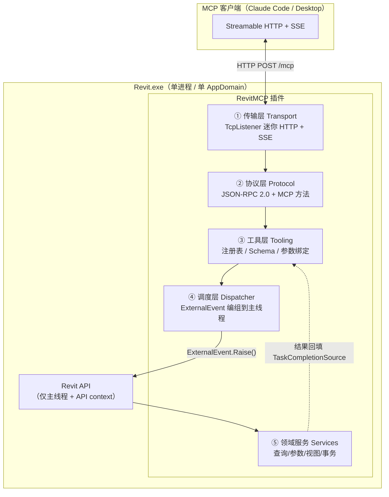

# RevitMCP 架构设计方案

> 目标形态：**纯 C# 单进程**——MCP Server 直接跑在 Revit 进程内，由插件托管。
> 目标平台：**Revit 2019 – 2024**（2019/2020 为 .NET Framework 4.7，2021+ 为 4.8）。
> 状态：M0 骨架已落地。下文标注 **[M0 已修订]** 的条目是实现阶段推翻的原始设计，以修订后内容为准。

---

## 0. 目标与非目标

### 目标
- 让 Claude Code / Claude Desktop 等 MCP 客户端能直接读写**当前打开的 Revit 文档**。
- 提供一套**可扩展的工具（Tool）开发框架**：新增一个工具 = 写一个类 + 一个 DTO，不碰传输层和协议层。
- 正确处理 Revit 的 **API 上下文与线程约束**，不出现"跨线程调用 API"崩溃。
- 写操作可撤销、可审计、默认关闭。

### 非目标（本期不做）
- 不做无界面/批处理模式（Revit 需要已启动并打开文档）。
- 不做 Revit Server / BIM360 协同层的封装。
- 不做远程访问（只监听 `127.0.0.1`）。
- ~~不做多版本同源产出~~ **[M0 已修订]** 最低版本定为 2019 后，2019–2024 六个版本的多版本矩阵
  已在 M0 建成（一套源码 + 按配置切换 TFM / API 包 / 编译符号，见 §9）。
  这类能力后补的代价远高于一开始就做。

---

## 1. 总体架构



**线程边界只有一条，且只在 ④**：①②③ 全部跑在后台线程池，⑤ 只在 Revit 主线程执行。这条边界是整个框架的核心，见 §5。

### 分层职责

| 层 | 程序集 | 目标框架 | 是否依赖 Revit API |
|---|---|---|---|
| ① 传输 | `RevitMCP.Transport` | netstandard2.0 | ✗ |
| ② 协议 | `RevitMCP.Protocol` | netstandard2.0 | ✗ |
| ③ 工具框架 | `RevitMCP.Tooling` | netstandard2.0 | ✗ |
| ④⑤ 宿主+工具实现 | `RevitMCP.Addin` | net48 | ✓ |

**刻意把 ①②③ 做成不依赖 Revit 的程序集**，目的是这三层能脱离 Revit 跑普通单元测试（见 §11）。只有 `RevitMCP.Addin` 需要 Revit 才能测。

---

## 2. 关键约束 → 设计决策

这一节是全文的推导依据，后面所有选择都能回溯到这里。

| # | 约束（Revit / MCP 的硬事实） | 推导出的决策 |
|---|---|---|
| C1 | Revit API 只能在**主线程**、且处于 **API context** 时调用 | 引入 `RevitDispatcher`（`IExternalEventHandler`），所有 API 调用编组过去（§5） |
| C2 | Revit 把所有插件加载进**同一个 AppDomain**，且**不应用插件自己的绑定重定向**（生效的是 `Revit.exe.config`） | 协议层尽量零第三方依赖；依赖必须 ILRepack 内联化（§4） |
| C3 | Revit 是用户手动启动的 GUI 进程，MCP 客户端**无法把它当 stdio 子进程拉起** | 传输必须是 **HTTP**（Streamable HTTP），不能用 stdio（§3） |
| C4 | `System.Net.HttpListener` 在非管理员下常因 URL ACL 报 `Access is denied` | 自己用 `TcpListener` 写迷你 HTTP/1.1 服务（§3） |
| C5 | 事务中的警告会弹**模态对话框**，把整个 Revit 和服务一起卡死 | 强制 `IFailuresPreprocessor` + `DialogBoxShowing` 拦截（§7） |
| C6 | 有模态对话框打开时，`ExternalEvent` 不会被执行 | 每次调用必须有超时，并返回明确的 `REVIT_BUSY`（§5） |
| C7 | 本地 HTTP MCP 服务面临 DNS rebinding 攻击（MCP 规范明确要求校验 `Origin`） | 强制 `Origin` 白名单 + Bearer Token + 仅绑 `127.0.0.1`（§8） |
| C8 | Revit 2024 起 `ElementId` 变为 64 位（`.Value`），`IntegerValue` 弃用 | 全局走 `ElementIdCompat` shim，ID 在协议上一律用字符串（§9） |

---

## 3. ① 传输层设计

### 为什么不是 stdio
MCP 最常见的是 stdio，但 stdio 要求客户端**自己 spawn 服务进程**。Revit 是用户双击启动的重型 GUI 应用，不可能由 Claude 拉起。因此只能反过来：Revit 常驻，客户端连过来 → **Streamable HTTP**。

客户端接入方式：
```bash
claude mcp add --transport http revit http://127.0.0.1:7801/mcp --header "Authorization: Bearer <token>"
```

### 为什么不用 HttpListener
`HttpListener` 需要 URL 预留（`netsh http add urlacl`），否则非管理员启动 Revit 时大概率抛 `HttpListenerException(5)`。要求用户以管理员跑 Revit 或手动 netsh，是不可接受的部署摩擦。

**方案：基于 `TcpListener` 的最小 HTTP/1.1 实现**（约 300 行）。只需支持：
- `POST /mcp`：请求体 JSON-RPC，响应 `application/json`（单响应）或 `text/event-stream`（需要流式/进度时）
- ~~`GET /mcp`：服务端→客户端的 SSE 通道~~ **[M1 已修订]** 2026-07-28 移除了 GET 流端点，回 `405`
- ~~`DELETE /mcp`：结束会话~~ **[M1 已修订]** 同上，协议级会话已移除，回 `405`
- ~~`Mcp-Session-Id` 头做会话绑定~~ **[M1 已修订]** 规范要求忽略该头，不再签发或回显
- 只解析 `Content-Length` 定长 body（拒绝 chunked 请求，本地客户端不会用到）

> **[M1 已修订] 规范换代。** 编码时核对规范发现当前修订是 **2026-07-28**，它把 Streamable HTTP
> 改成了无状态形态：没有 `initialize` 握手，版本与能力改为随每个请求的 `_meta` 传递，
> 会话、GET SSE 流、`Last-Event-ID` 断点续传全部移除。
>
> 本设计原先是照 legacy 那一代（`2025-11-25` 及更早）写的。实现采取 **dual-era**：
> 规范明确允许服务端同时服务两代，判定依据是消息体里有没有
> `_meta["io.modelcontextprotocol/protocolVersion"]`——带就按 2026-07-28 无状态处理，
> 不带（或方法是 `initialize`）就按 legacy 握手语义处理。
>
> 这样选是因为 2026-07-28 距今才几周，客户端支持仍在铺开，而 dual-era 是严格超集：
> 无论对端说哪一代都能连上。代价是多一份 era 分支逻辑，收敛在
> `McpHttpHandler.DetectEra` 与 `McpRequestContext` 两处。

`TcpListener` 绑定 `127.0.0.1` 不需要任何 ACL，这是选它的唯一但充分的理由。

### 端口与实例发现
Revit 可能开多个实例。启动时从 `7801` 起探测第一个可用端口，并写：

```
%LOCALAPPDATA%\RevitMCP\instances\revit-<pid>.json
{ "pid": 12345, "port": 7801, "revitVersion": "2024",
  "activeDocument": "项目1.rvt", "startedAt": "...", "writeEnabled": false }
```

进程退出时删除（并在启动时清理 pid 已不存在的残留文件）。这样用户/脚本能知道该连哪个端口。

---

## 4. ② 协议层设计

### 依赖策略（这是 Revit 插件最容易翻车的地方）

已核实：`ModelContextProtocol.Core` 2.2.0 **确实提供 `netstandard2.0` 目标**，net48 能引用。但它的 netstandard2.0 依赖闭包是：

```
Microsoft.Bcl.Memory, Microsoft.Extensions.AI.Abstractions,
Microsoft.Extensions.Logging.Abstractions, System.Collections.Immutable,
System.Diagnostics.DiagnosticSource, System.IO.Pipelines,
System.Net.ServerSentEvents, System.Text.Json, System.Threading.Channels  (均 ≥10.x)
```

在 Revit 的单 AppDomain 里，这些程序集**先到先得**：如果另一个插件先加载了不同版本的 `System.Text.Json` / `System.Runtime.CompilerServices.Unsafe`，你就会拿到它的版本，而 Revit 不会应用你的绑定重定向。这是 Revit 插件圈的经典事故。

| 路线 | 做法 | 优点 | 代价 | 结论 |
|---|---|---|---|---|
| **A（推荐）** | 手写最小 MCP 协议层 | 零第三方依赖，彻底免疫冲突；协议面小，完全可控 | 约 600–900 行；需自己跟规范演进 | ✅ 本期采用 |
| B | 引用官方 SDK + ILRepack 全闭包内联化 | 蹭官方实现与后续更新 | ILRepack 处理 `System.Text.Json`/`Immutable` 很脆；升级 SDK 要重调打包 | 备选 |
| C | 拆成 net8 独立进程做 stdio 桥接，与插件走本地 IPC | 可直接用官方 SDK | 违背"单进程"约束，多一个进程要管生命周期 | 仅作为 A 失败时的逃生口 |

> 路线 A 的实际工作量被"MCP 协议很大"的印象高估了。**[M1 实测]** 手写协议层连同自带 JSON
> 共约 1100 行，方法面很小：`ping`、`tools/list`、`tools/call` 两代通用，
> `server/discover` 仅 modern，`initialize`、`notifications/initialized` 仅 legacy，其余返回 `-32601`。
> 规范在 M1 期间刚换代（见 §3），手写反而让适配只花了几十行——
> 若绑在官方 SDK 上，还得等它跟进并重新趟一遍依赖闭包。

### JSON 序列化 **[M0 已修订]**

~~原方案：引用 Revit 自带的 `Newtonsoft.Json.dll` 并设 `<Private>false</Private>`，运行时用 Revit 已加载的那份。~~

**改为自带最小 JSON 实现**（`RevitMCP.Protocol/Json/`，约 450 行：DOM + 解析器 + 写出器）。

改动理由：目标范围扩到 2019–2024 六个版本后，各版本 Revit 捆绑的 Newtonsoft 版本并不一致，
而"依赖一个自己不控制版本、且无法施加绑定重定向的程序集"正是 §2-C2 要规避的那类风险。
原方案还留下一个必须装 Revit 才能实测的开放项，会一直挂着。自带实现把这个问题一次性消除：
**最终产物只有 4 个自有 DLL，零第三方运行时依赖。**

实现上几个有意的取舍：
- 数值保存原始字面量，而非先转 `double`。JSON-RPC 的 id 与 Revit 2024 的 `ElementId` 都可能超出
  double 的 53 位安全整数范围，转一手就会悄悄丢精度。
- 解析器有 128 层深度上限。面向网络输入，深层嵌套报文会打爆调用栈，
  而 `StackOverflowException` 在 .NET 上无法捕获，会直接带走整个 Revit 进程。
- 对象成员保持插入顺序，让 `config.json` 对人可读、协议报文的 diff 可比。
- 严格拒绝前导零、未转义控制字符、尾随内容等非法输入，不做"宽容解析"。

### 方法分发 **[M1 已修订]**

方法只有六个，`switch` 比注册表更直白，最终没有引入 `IRpcMethod` 抽象：

| 方法 | modern (2026-07-28) | legacy (≤2025-11-25) |
|---|---|---|
| `ping` | ✓ | ✓ |
| `tools/list` | ✓ | ✓ |
| `tools/call` | ✓ | ✓ |
| `server/discover` | ✓（规范要求必须实现） | ✗ → `-32601` |
| `initialize` | ✗ → `-32601` | ✓ |
| `notifications/initialized` | ✗ | ✓ → `202` |

era 差异收敛在两处，别的地方不需要关心自己在服务哪一代：
- `McpRequestContext.NewResult()`：modern 的结果对象要带 `resultType: "complete"`，legacy 不认识它。
- `McpServer.IsKnownMethod(method, era)`：决定某方法在该代是否存在。

HTTP 层的义务（Origin 校验、Bearer 认证、era 判定、头/体一致性校验、状态码选择）
全在 `McpHttpHandler`，协议层与传输无关。

### 错误模型（两套，不要混用）
- **协议级错误** → JSON-RPC `error`：`-32700` 解析失败、`-32600` 非法请求、`-32601` 方法不存在、`-32602` 参数非法、`-32603` 内部错误。
  **[M1 补充]** 加上 MCP 在保留区间分配的两个码：`-32020` HeaderMismatch（头与消息体不一致）、
  `-32022` UnsupportedProtocolVersion（`data.supported` 必须列出我们支持的版本，客户端据此重试）。
  另外 modern 下的 `-32601` 规范要求配 **HTTP 404**，好和"这台服务器压根没有 MCP 端点"的裸 404 区分开；
  legacy 下仍是 HTTP 200。
- **工具执行失败** → `tools/call` 正常返回，但 `isError: true` + 文本内容说明原因。
  这点很关键：**工具失败要让模型看见并自我纠正**，包成 JSON-RPC error 会让客户端当成传输故障。

领域错误码（放进 `isError` 文本，便于模型识别；定义见 `RevitMCP.Tooling/McpDomainError.cs`）：

| 码 | 含义 | 模型可否安全重试 |
|---|---|---|
| `REVIT_BUSY` | 主线程被模态框或长运算占用，**工作从未开始** | 可以，模型未被触碰 |
| `TIMEOUT` | 工作**已开始**但未在超时内完成 | **不可**，模型可能已被部分修改 |
| `NO_ACTIVE_DOC` | Revit 中没有打开文档 | 需用户先打开模型 |
| `WRITE_DISABLED` | 写保护未开启 | 需用户在 Ribbon 上开启 |
| `SERVER_STOPPED` | 服务正在关闭 | — |
| `CONFIRMATION_REQUIRED` | 影响面超过 `maxElementsPerWrite` | 可以，但必须带 `confirm: true` 重来 |
| `ELEMENT_NOT_FOUND` / `INVALID_PARAMETER` / `TRANSACTION_FAILED` | 见字面 | 视情况 |

"可否安全重试"这一列是这张表存在的理由：模型看到错误后要不要再来一次，全取决于它。

---

## 5. ④ 调度层：线程模型（**全框架最核心的一节**）

> **[M2 已修订] 拆成两半。** 原设计把调度器整个放在 `RevitMCP.Addin` 里。
> 但这一层的语义（排队、超时、放弃、竞态）恰恰是最需要测试、也最难靠肉眼看对的部分，
> 而放在 Addin 里就必须有 Revit 才能跑。
>
> 实现拆成：
> - `RevitMCP.Tooling/Dispatch/DispatchQueue<TContext>`——**不依赖 Revit**，泛型化上下文。
>   全部超时/放弃/竞态语义在这里，19 个测试在 CI 上覆盖。
> - `RevitMCP.Addin/Dispatcher/RevitDispatcher`——极薄的壳，只做 `ExternalEvent` 接线，
>   同时实现 `IExternalEventHandler` 和 `IDispatchSignal`。
>
> 代价是 §1 的分层图里 ④ 现在跨了两个程序集；换来的是这一层能在没装 Revit 的机器上验证。

### 问题
HTTP 请求到达在线程池线程上，而 Revit API 必须在主线程、且处于有效 API context 中调用。跨线程碰 `Document` 轻则抛 `InvalidOperationException`，重则直接崩 Revit。

### 方案：`ExternalEvent` + `TaskCompletionSource`

`ExternalEvent.Raise()` 是 Revit 明确保证**可从任意线程调用**的少数 API 之一。用它把闭包投递回主线程，结果通过 `TaskCompletionSource` 回填给 HTTP 线程。

```csharp
public sealed class RevitDispatcher : IExternalEventHandler
{
    private readonly ConcurrentQueue<WorkItem> _queue = new ConcurrentQueue<WorkItem>();
    private ExternalEvent _event;

    /// <summary>必须在 OnStartup（主线程）调用，否则 ExternalEvent.Create 会失败。</summary>
    public void Initialize() => _event = ExternalEvent.Create(this);

    public async Task<T> InvokeAsync<T>(Func<UIApplication, T> work, TimeSpan timeout, CancellationToken ct)
    {
        var item = new WorkItem(app => work(app));
        _queue.Enqueue(item);
        _event.Raise();   // Accepted / Pending 都是正常的，不要当错误处理

        using (var cts = CancellationTokenSource.CreateLinkedTokenSource(ct))
        {
            cts.CancelAfter(timeout);
            try { return (T)await item.Completion.Task.WaitAsync(cts.Token); }
            catch (OperationCanceledException)
            {
                item.MarkAbandoned();   // 见下方"超时语义"
                throw new RevitBusyException(
                    "Revit 未在超时内进入空闲状态，通常是有模态对话框打开或正在长时间运算。");
            }
        }
    }

    /// <summary>由 Revit 在主线程调用，此时具备 API context。</summary>
    public void Execute(UIApplication app)
    {
        var budget = Stopwatch.StartNew();
        // 一次 Execute 尽量排干队列，但设时间预算，避免长时间冻结 UI
        while (budget.ElapsedMilliseconds < 200 && _queue.TryDequeue(out var item))
            item.Run(app);          // Run 内部 try/catch，异常回填到 TCS

        if (!_queue.IsEmpty) _event.Raise();   // 还有剩余，下一轮继续
    }

    public string GetName() => "RevitMCP Dispatcher";
}
```

### 必须写进代码注释的四个坑

1. **`ExternalEvent.Create` 只能在主线程调用**，且只能在 `OnStartup` 期间创建一次。放到第一次请求时懒加载会失败。
2. **`Raise()` 返回 `Pending` 不是错误**，只是表示上一次尚未执行完，无需重试。
3. **超时不等于取消。** `ExternalEvent` 没有取消机制——超时后那个 `WorkItem` 仍可能在晚些时候被执行。所以放弃标记后 `Pump()` 必须自检并跳过，否则会对文档做出"客户端已经放弃"的修改。这是本设计里最隐蔽的正确性问题。

   **[M2 已实现并加强]** 光有"放弃标记"还不够——**超时与执行本身是竞态的**。
   两者都用 `Interlocked.CompareExchange` 去抢同一个状态位，只有一方能赢：

   | 谁抢到 | 含义 | 返回给调用方 |
   |---|---|---|
   | 超时方抢到 `Pending → Abandoned` | 工作**从未开始**，模型确定未被触碰 | `REVIT_BUSY` |
   | 泵抢到 `Pending → Running` | 工作**已在执行**，模型可能已变 | 宽限 10s；仍未完成则 `TIMEOUT` |

   原设计只有 `REVIT_BUSY` 一种超时。但对一条已经跑起来的写操作回 `REVIT_BUSY`，
   等于告诉模型"什么都没发生"，它会据此重试——**这比超时本身危险得多**。
   两种超时必须是不同的错误码。
4. **时间预算 200ms** 是为了不让一批长任务把 Revit UI 冻住。单个工具自身超时另计（默认 60s，工具可声明覆盖）。

### 长任务与进度
超过 ~5s 的工具（如全模型遍历）应通过 SSE 发 `notifications/progress`，避免客户端判定超时。工具通过注入的 `IProgressReporter` 上报。

---

## 6. ③ 工具层：扩展开发体验

框架的价值在这里——**新增一个工具应该只需要写一个类**。

```csharp
[McpTool("revit_query_elements",
         Title = "按类别查询构件",
         Description = "在当前文档中按类别/视图/参数条件查询构件，返回 ID 与基本属性。",
         ReadOnly = true,                 // 只读工具，写保护关闭时也可用
         TimeoutSeconds = 30)]
public sealed class QueryElementsTool : IRevitTool<QueryElementsInput, QueryElementsOutput>
{
    public QueryElementsOutput Execute(QueryElementsInput input, RevitToolContext ctx)
    {
        // 这里已经在主线程 + API context 中，可以安全直接调 Revit API
        var doc = ctx.Document;
        var collector = new FilteredElementCollector(doc)
            .OfCategory(input.Category.ToBuiltInCategory())
            .WhereElementIsNotElementType();
        ...
    }
}

public sealed class QueryElementsInput
{
    [McpParam("Revit 类别名，如 OST_Walls", Required = true)]
    public string Category { get; set; }

    [McpParam("最多返回数量，默认 200")]
    public int? Limit { get; set; }
}
```

### 注册
`OnStartup` 时反射扫描当前程序集中所有带 `[McpTool]` 的类型，构造并注入 `ToolRegistry`。不做外部插件式动态加载（Revit 单 AppDomain 下热加载弊大于利）。

### JSON Schema 生成
`tools/list` 需要每个工具的 `inputSchema`。用一个约 200 行的反射式 Schema 生成器，从 Input DTO 推导：

| C# 类型 | JSON Schema |
|---|---|
| `string` | `{"type":"string"}` |
| `int` / `double` / 可空 | `{"type":"integer"} 或 {"type":"number"}`，可空则不进 `required` |
| `bool` | `{"type":"boolean"}` |
| `enum` | `{"type":"string","enum":[...]}` |
| `List<T>` | `{"type":"array","items":{...}}` |
| 嵌套类 | 递归展开为 `object` |

`[McpParam]` 的描述文本填进 `description`，`Required = true` 或非可空值类型进 `required` 数组。

> 不引入 `NJsonSchema` 等库——理由同 §4，任何新依赖都是 Revit AppDomain 里的风险。

**[M3 补充] 必填规则只有一条，三处共用。**
`string` 是引用类型 → 可选；`int` 不可空 → 必填；`int?` → 可选；`[McpParam(Required = true)]` → 必填。
Schema 生成、入参绑定、文档三者必须给出同一个答案，所以判定集中在
`TypeIntrospection.IsRequired` 一个方法里——分散实现会表现为
"Schema 说可选、绑定却报必填"这类极难排查的问题。

**绑定刻意严格：未知字段报错，且先于必填检查。**
字段拼错时两种错误会同时出现；先报"未知参数 catgeory，可用参数：category、limit、nameContains"
比先报"缺少 category"更能让模型一次改对。静默忽略最糟——模型会一直以为自己传对了。
（这一条是写端到端测试时才暴露出来的，原顺序反了。）

### 执行管线
```
tools/call
  → 查注册表
  → 反序列化 + 校验 Input（失败 → INVALID_PARAMETER）
  → 写保护检查（非 ReadOnly 且写模式关闭 → WRITE_DISABLED）
  → Dispatcher.InvokeAsync(...)         ← 唯一的线程边界
       → 打开事务（非 ReadOnly 才开）
       → Tool.Execute
       → Commit / RollBack
  → 序列化 Output → content[]
```

工具作者**完全不接触**线程、事务、序列化——这三件事由管线统一处理。这是框架与"一堆散装命令"的本质区别。

> **[M3 已修订] 写保护检查必须在编组之前。** 上面的顺序是对的，实现时也照此落实并加了测试：
> 被写保护拒绝的调用不该占用 Revit 主线程，否则一个反复试探写工具的模型能把 UI 拖垮。
>
> **[M3 已修订] 管线也不依赖 Revit。** `ToolPipeline<TContext>` 通过
> `IWorkDispatcher<TContext>` 拿到线程编组能力，上下文在插件里是 `UIApplication`、
> 在测试里是假模型。因此整条"HTTP → 协议 → 管线 → Schema → 工具"链路能在 CI 上端到端跑通。
>
> **[M4 已修订] 事务那一步已接入**（图中"打开事务"一行）。接法是往管线注入
> `IWriteScope<TContext>`——接口定义在不依赖 Revit 的 Tooling 层，真实现
> `RevitWriteScope` 在 Addin 层。这样"只读工具不开事务、写工具开事务、失败必回滚"
> 这套判断能脱离 Revit 测试，而它一旦错了代价是用户模型被改坏。
>
> **[M4 新增] 被抑制的警告随输出一起回来。** `ToolExecutionContext.Warnings` 由管线注入，
> 失败预处理器、对话框拦截器和工具自己都往里写；管线在序列化后把非空的它并成输出的
> `warnings` 字段。工具作者不必在自己的 Output DTO 里另开字段。
> 调用失败时不附加——失败文本本身已说明原因，再挂一串警告只会喧宾夺主。
>
> **配置用委托读取而非启动时快照**：用户在 Ribbon 上切换写入开关后立即生效，不必重启服务。

---

## 7. ⑤ 事务与安全执行

> **[M4 已实现]** 本节全部落地在 `src/RevitMCP.Addin/Execution/`：
> `RevitWriteScope`（事务）、`McpFailurePreprocessor`（防线一）、`DialogSuppressor`（防线二）。

### 事务策略
- 每个写工具跑在**独立 `Transaction`** 中，命名 `MCP: <工具名>`，用户在撤销栈里能看懂、能单步撤销。
- 需要多步的工具用 `TransactionGroup` + `Assimilate()`，对外仍是一步撤销。
- 异常 → `RollBack()`，并回填 `TRANSACTION_FAILED`。

### 绝不能弹模态框（否则整个服务死锁）
两道防线，**两道都要有**：

```csharp
// 防线一：事务级的警告预处理
var opts = tx.GetFailureHandlingOptions();
opts.SetFailuresPreprocessor(new McpFailurePreprocessor()); // 警告→删除，错误→回滚并记录
opts.SetForcedModalHandling(false);
opts.SetClearAfterRollback(true);
tx.SetFailureHandlingOptions(opts);

// 防线二：兜底拦截任何仍然冒出来的对话框
uiApp.DialogBoxShowing += OnDialogBoxShowing;   // 工具执行期间启用，结束后务必解绑
```

防线二必须用 `try/finally` 解绑：否则 MCP 工具跑完后，用户自己操作 Revit 时的正常对话框也会被吃掉。这是会被当成"Revit 坏了"的严重回归。

所有被抑制的警告都要写进工具返回结果，让模型和用户知道发生了什么——**静默吞掉警告比弹框更危险**。

### 写保护
- 默认 `writeEnabled = false`，只读工具可用，写工具直接返回 `WRITE_DISABLED`。
- 用户在 Ribbon 上显式切换开关才启用写入，切换状态写回 `config.json` 与实例发现文件。
- **规模阈值**（M4 已实现）：单次工具修改超过 `maxElementsPerWrite`（默认 500）个构件时返回
  `CONFIRMATION_REQUIRED`，要模型带显式 `confirm: true` 重来。判断在 `RevitTool.GuardScale`，
  阈值由管线从配置送进 `ToolExecutionContext`。

  这道闸的意义不在于阻止"想改 600 个"，而在于阻止"以为在改 6 个、实际匹配到 600 个"——
  后者才是真正会毁掉模型的那种错误。

---

## 8. 安全设计

| 措施 | 说明 |
|---|---|
| 仅绑 `127.0.0.1` | 不监听 `0.0.0.0`，杜绝局域网访问 |
| Bearer Token | 首次启动生成随机 token 存 `config.json`，Ribbon 提供"复制接入命令"按钮 |
| `Origin` 校验 | MCP 规范对本地 HTTP 服务的明确要求，防 DNS rebinding。无 `Origin` 头（原生客户端）放行，有则必须在白名单内 |
| 工具白名单 | `config.json` 可禁用指定工具 |
| 写保护开关 | 见 §7 |
| 审计日志 | 每次 `tools/call` 记录工具名、参数摘要、影响构件数、耗时、结果 |

---

## 9. 版本兼容 shim

**[M0 已修订]** 多版本矩阵已建成。配置名形如 `Debug R24` / `Release R19`，
R 后的年份在 `Directory.Build.props` 中同时决定三件事——目标框架、Revit API 包版本、条件编译符号：

| Revit | 配置 | TFM | Revit API 包（Nice3point，`ref/` 引用程序集，不随产物分发） |
|---|---|---|---|
| 2019 | `R19` | net47 | 2019.2.11 |
| 2020 | `R20` | net47 | 2020.2.60 |
| 2021 | `R21` | net48 | 2021.1.50 |
| 2022 | `R22` | net48 | 2022.1.80 |
| 2023 | `R23` | net48 | 2023.1.90 |
| 2024 | `R24` | net48 | 2024.3.60 |

符号分两类：精确的 `REVIT2024`，与累进的 `REVIT2021_OR_GREATER` 等。绝大多数 shim 用后者。
新增一个 Revit 版本 = 在 `Directory.Build.props` 加一个 `PropertyGroup` + 在 `Configurations` 加两项。
本机无需安装 Revit 即可构建全部六个版本。

**API 差异只允许出现在 `src/RevitMCP.Addin/Compat/`**，其他地方一律走那里的兼容方法：

```csharp
internal static class ElementIdCompat
{
#if REVIT2024_OR_GREATER
    public static long GetValue(this ElementId id) => id.Value;          // 2024 起为 Int64
    public static ElementId Create(long v) => new ElementId(v);
#else
    public static long GetValue(this ElementId id) => id.IntegerValue;   // 2023 及以前为 Int32
    public static ElementId Create(long v) => new ElementId(checked((int)v));
#endif
}
```

**协议层面的 ElementId 一律用字符串**（`"123456"`），不用 JSON number。理由：避开 32/64 位差异，也避开 JS 端 `Number` 精度问题。

其他已知差异点登记表（编码时逐条确认）：

| Revit 版本 | .NET | 关键差异 |
|---|---|---|
| 2024 | 4.8 | `ElementId` → Int64；`.Value` 取代 `.IntegerValue` |
| 2023 | 4.8 | `ElementId.IntegerValue`(int) |
| 2022 / 2021 | 4.8 | 同上 |
| 2020 / 2019 | 4.7.2 | 同上；部分 `FilteredElementCollector` 重载缺失 |

---

## 10. 配置、部署与生命周期

### 配置文件
`%APPDATA%\RevitMCP\config.json`
```json
{
  "port": 7801,
  "autoStart": true,
  "token": "<首次启动自动生成>",
  "writeEnabled": false,
  "maxElementsPerWrite": 500,
  "defaultToolTimeoutSeconds": 60,
  "disabledTools": [],
  "allowedOrigins": ["http://localhost", "https://claude.ai"],
  "logLevel": "Information"
}
```

### 插件清单
`RevitMCP.addin` → `%PROGRAMDATA%\Autodesk\Revit\Addins\2019\`
```xml
<?xml version="1.0" encoding="utf-8"?>
<RevitAddIns>
  <AddIn Type="Application">
    <Name>App</Name>
    <Assembly>RevitMCP\RevitMCP.Addin.dll</Assembly>
    <ClientId>4938c604-c0a9-4e9b-a34d-d7ae44888413</ClientId>
    <FullClassName>RevitMCP.Addin.App</FullClassName>
    <VendorId>ADSK</VendorId>
    <VendorDescription>Autodesk, www.autodesk.com</VendorDescription>
  </AddIn>
  <AddIn Type="Command">
    <Assembly>RevitMCP\RevitMCP.Addin.dll</Assembly>
    <ClientId>56e13c5a-4d8c-4467-9e5c-51c9da088280</ClientId>
    <FullClassName>RevitMCP.Addin.Commands.CopyConnectCommand</FullClassName>
    <Text>CopyConnectCommand</Text>
    <Description>""</Description>
    <VisibilityMode>AlwaysVisible</VisibilityMode>
    <VendorId>ADSK</VendorId>
    <VendorDescription>Autodesk, www.autodesk.com</VendorDescription>
  </AddIn>
  <AddIn Type="Command">
    <Assembly>RevitMCP\RevitMCP.Addin.dll</Assembly>
    <ClientId>8c2cfa6d-6381-4029-9d5d-12099ba0ca81</ClientId>
    <FullClassName>RevitMCP.Addin.Commands.OpenLogCommand</FullClassName>
    <Text>OpenLogCommand</Text>
    <Description>""</Description>
    <VisibilityMode>AlwaysVisible</VisibilityMode>
    <VendorId>ADSK</VendorId>
    <VendorDescription>Autodesk, www.autodesk.com</VendorDescription>
  </AddIn>
  <AddIn Type="Command">
    <Assembly>RevitMCP\RevitMCP.Addin.dll</Assembly>
    <ClientId>e3cd443f-edc3-4827-9f2d-727ed245a90a</ClientId>
    <FullClassName>RevitMCP.Addin.Commands.ToggleServerCommand</FullClassName>
    <Text>ToggleServerCommand</Text>
    <Description>""</Description>
    <VisibilityMode>AlwaysVisible</VisibilityMode>
    <VendorId>ADSK</VendorId>
    <VendorDescription>Autodesk, www.autodesk.com</VendorDescription>
  </AddIn>
  <AddIn Type="Command">
    <Assembly>RevitMCP\RevitMCP.Addin.dll</Assembly>
    <ClientId>2806cf0c-cd44-405c-8691-4904bd9a52e6</ClientId>
    <FullClassName>RevitMCP.Addin.Commands.ToggleWriteModeCommand</FullClassName>
    <Text>ToggleWriteModeCommand</Text>
    <Description>""</Description>
    <VisibilityMode>AlwaysVisible</VisibilityMode>
    <VendorId>ADSK</VendorId>
    <VendorDescription>Autodesk, www.autodesk.com</VendorDescription>
  </AddIn>
</RevitAddIns>
```

### 生命周期
- `OnStartup`：建 Ribbon → `Dispatcher.Initialize()`（**必须在此，见 §5 坑 1**）→ 扫描注册工具 → 读配置 → `autoStart` 则起监听。
- `OnShutdown`：停监听、断开所有 SSE 会话、解绑事件、删除实例发现文件。
- Ribbon 面板：`启动/停止`（带状态灯）、`写入模式`开关、`复制接入命令`、`打开日志`。

### 安装
`build/install.ps1`：编译 → 复制 DLL 到 `%APPDATA%\Autodesk\Revit\Addins\<ver>\RevitMCP\` → 写 `.addin` → 提示重启 Revit。
注意从网络/邮件拿到的 DLL 需 `Unblock-File`，否则 Revit 静默不加载——这是最常见的"插件没出现"原因。

---

## 11. 测试策略

分三层，**大部分测试不需要 Revit**：

| 层级 | 范围 | 是否需要 Revit |
|---|---|---|
| 单元测试 | 协议层（JSON-RPC 编解码、错误码）、Schema 生成器、HTTP 解析、参数绑定 | ✗ |
| 契约测试 | 用 `IRevitContext` 的内存假实现跑完整 `tools/call` 管线 | ✗ |
| 集成测试 | Revit 内真实执行，带样板 rvt 文件 | ✓ |

> 这正是 §1 把 ①②③ 拆成不依赖 Revit 程序集的回报：CI 上能跑掉 80% 的测试。

**把 `Document` 访问抽象成 `IRevitContext`**，工具单测时注入假实现。注意 Revit API 的类大多是 sealed 且无接口，无法直接 mock——所以要在**领域服务层**（⑤）而不是 Revit 类型上做抽象边界。

集成测试用 Revit 自带的插件入口跑（`IExternalCommand` 触发测试套件），结果写文件；不追求在 CI 上跑 Revit。

### 冒烟检查清单（每次改动手动过一遍）
1. Revit 启动无异常，Ribbon 出现
2. `initialize` → `tools/list` 返回完整 schema
3. 只读工具在写保护开启时可用
4. 写工具在写保护关闭时返回 `WRITE_DISABLED`
5. 写工具执行后，Revit 撤销栈出现 `MCP: <工具名>`，可正常撤销
6. **打开一个模态对话框，调用任意工具 → 应在超时后返回 `REVIT_BUSY`，且 Revit 不卡死**
7. 工具执行完后，手动操作 Revit 的正常对话框仍能弹出（验证 §7 防线二已解绑）
8. 关闭 Revit → 实例发现文件被清理

---

## 12. 目录结构

```
RevitMCP/
├─ src/
│  ├─ RevitMCP.Transport/          # netstandard2.0，无 Revit 依赖
│  │   ├─ MiniHttpServer.cs        # TcpListener + HTTP/1.1 解析
│  │   ├─ SseStream.cs
│  │   └─ SessionManager.cs
│  ├─ RevitMCP.Protocol/           # netstandard2.0，无 Revit 依赖
│  │   ├─ JsonRpc/                 # Request/Response/Error
│  │   ├─ Methods/                 # initialize / tools.list / tools.call / ping ...
│  │   └─ McpServer.cs
│  ├─ RevitMCP.Tooling/            # netstandard2.0，无 Revit 依赖
│  │   ├─ McpToolAttribute.cs
│  │   ├─ ToolRegistry.cs
│  │   ├─ SchemaGenerator.cs
│  │   └─ ToolPipeline.cs
│  └─ RevitMCP.Addin/              # net48，引用 RevitAPI / RevitAPIUI
│      ├─ App.cs                   # IExternalApplication + Ribbon
│      ├─ Dispatcher/RevitDispatcher.cs
│      ├─ Execution/               # 事务、失败预处理、对话框拦截（M4）
│      ├─ Compat/ElementIdCompat.cs
│      ├─ Services/                # 查询/参数/视图/几何
│      ├─ Tools/                   # 具体工具实现
│      └─ RevitMCP.addin
├─ tests/
│  ├─ RevitMCP.Protocol.Tests/
│  ├─ RevitMCP.Tooling.Tests/
│  └─ RevitMCP.Integration/        # Revit 内运行
├─ build/  install.ps1 / package.ps1
├─ samples/ 测试用 rvt
└─ docs/architecture.md
```

---

## 13. 实施里程碑

| 里程碑 | 内容 | 验收标准 |
|---|---|---|
| **M0 骨架** ✅ | 解决方案、四个项目、六版本矩阵、`.addin`、Ribbon、配置、日志、JSON 层、install.ps1 | Revit 启动能看到面板（**待用户在装有 Revit 的机器上验证**） |
| **M1 通路** ✅ | TcpListener HTTP + JSON-RPC + dual-era 握手 + Origin/Bearer/头校验 | `curl` 两代握手均通过；38 个端到端测试 |
| **M2 调度** ✅ | `DispatchQueue` + `RevitDispatcher` + 双重超时语义 + 首个诊断工具 | 19 个调度测试（含变异验证）；**冒烟项 6 待在 Revit 中验证** |
| **M3 工具框架** ✅ | `[McpTool]`、注册表、Schema 生成、双向映射、执行管线 + 4 个只读工具 | 58 个框架测试 + 4 个 HTTP 端到端；curl 验证 `tools/list`/`tools/call`。**真实 Revit 工具待在 Revit 中验证** |
| **M4 写入** ✅ | 事务管线、失败预处理、对话框拦截、写保护、规模阈值 + 2 个写工具 | 13 个写作用域测试（共 146 个）；六版本矩阵全编译。**冒烟项 4/5/7 待在 Revit 中验证** |
| **M5 打磨** | SSE 进度通知、日志与审计、多实例发现、文档 | 完整冒烟清单通过 |

首批工具（覆盖典型读写形态，用来验证框架而非堆功能）：

**[M3 已实现]** `revit_get_document_info`、`revit_list_categories`、`revit_query_elements`、
`revit_get_element_parameters`（均只读）。

`revit_list_categories` 是实现时加的：没有它，模型只能凭记忆猜 `BuiltInCategory` 名。
同理 `ParseCategory` 在解析失败时会返回相近候选，而不是干巴巴一句"无效类别"——
**面向模型的错误信息应当包含改正所需的信息**，这条原则贯穿整个工具层。

**[M4 已实现]** `revit_set_element_parameters`、`revit_create_wall`（写）。

两个写工具各自验证了一类形态：前者是**批量改已有构件**（要全有全无的原子性、要规模闸、
要把字符串按目标参数的 `StorageType` 转换），后者是**新建构件**（要解析并回填默认值，
把"用了哪个标高、哪个墙类型"通过 `warnings` 告诉模型）。

`revit_create_wall` 的坐标与尺寸一律用**毫米**，内部按 `1 ft = 304.8 mm` 这个精确定义值换算。
不走 `UnitUtils` 是刻意的：它的 API 在 2021 前后不兼容，硬编码常量省掉一整类版本问题。

---

## 14. 风险清单

| 风险 | 影响 | 应对 |
|---|---|---|
| 与其他插件的程序集版本冲突 | Revit 启动崩溃或运行时 `FileLoadException` | 路线 A 零依赖；Newtonsoft 用 Revit 自带且 `Private=false` |
| 模态对话框导致服务假死 | 所有请求超时 | §5 超时 + §7 双防线；冒烟项 6 强制回归 |
| 超时后 `ExternalEvent` 迟到执行 | **静默修改用户模型** | **[M2 已消除]** CAS 抢占式放弃 + `Pump` 自检；并用变异测试确认（去掉自检后正好两条测试变红）|
| 对话框拦截未解绑 | 用户正常操作的对话框被吞 | `try/finally` + 冒烟项 7 |
| Revit 自带 Newtonsoft 版本不符 | 编译/运行失败 | 回退 ILRepack 内联改名 |
| MCP 规范演进（路线 A 需自维护） | 客户端兼容性下降 | **[M1 已验证]** 规范在 M1 期间刚换代（2026-07-28），dual-era 适配只花了几十行。持续风险是 modern 那代的 MRTR、`subscriptions/listen` 等新机制尚未实现 |
| 未实测过真实 MCP 客户端 | 与 Claude Code 实际对接时才暴露不兼容 | curl 已覆盖两代握手与全部错误路径，但真实客户端的行为细节仍需在装有 Revit 的机器上验证 |
| 模型误操作大批量构件 | 模型损坏 | 写保护默认关 + 规模阈值 + 单步可撤销事务 |

---

## 附：待确认事项（编码前逐项落实）

1. ~~目标 Revit 具体版本号~~ **已定**：2019–2024，六版本矩阵见 §9。
2. ~~Revit 自带 `Newtonsoft.Json.dll` 的确切版本~~ **已消除**：改用自带 JSON 实现，见 §4。
3. ~~客户端主要是 Claude Code 还是 Claude Desktop~~ **已降级为非阻塞**：原生客户端不发 `Origin`，
   白名单只对浏览器来源生效，保持 `http://localhost` / `http://127.0.0.1` / `https://claude.ai` 即可。
4. 是否需要 SSE 服务端推送（若首批工具都在 5s 内返回，M5 可延后）。
   **[M1 备注]** 现在所有响应都是 `application/json`，规范允许；
   一旦有工具超过 ~5s，就必须补 `text/event-stream` 发 `notifications/progress`。
5. **新增**：2019/2020 的 Revit API 参考程序集停在 2021 年，若届时发现某些 API 在
   2019 上确实缺失（如部分 `FilteredElementCollector` 重载），需决定是降级实现还是把最低版本上调到 2021。
   到 M3 写第一批工具时才会真正暴露。
